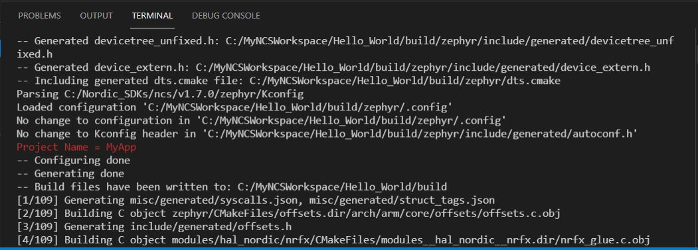

# CMake: Adding messages in CMakeLists.txt file for debugging

## Introduction

CMake is used to control the software compilation process. It is a kind of skript language that allows you 
to process configuration files, DeviceTree definition, and further project settings. 
CMake is also working with variables, that can only be seen wihtin CMake. And sometimes it may be helpful if you could debug and get some information about the variable contents. 
In this chapter we will output CMake variables.

Note: further information about CMake can be found on [cmake.org](cmake.org).

## Required Hardware/Software for Hands-on
- one nRF52 development kit (e.g. nRF52DK, nRF52833DK, or nRF52840DK)
- install the _nRF Connect SDK_ v2.3.0 and _Visual Studio Code_. The description of the installation can be found [here](https://developer.nordicsemi.com/nRF_Connect_SDK/doc/2.3.0/nrf/getting_started/assistant.html#).

## Hands-on step-by-step description 

1) Let's start with the hello_world project. Add this project to your Visual Studio Code workspace. 
2) Open CMakeLists.txt file. Here we see the command __project(MyApp)__. Let's take a closer look to the __project()__ command. The description of this CMake command can be found here:

   [https://cmake.org/cmake/help/latest/command/project.html](https://cmake.org/cmake/help/latest/command/project.html)

3) In the __project()_ command description you see that it uses varialbes to store some information. Let's pick one of these variables and try to output it when running CMake:
   - PROJECT_NAME: The name of the project is stored here. The project name is the first parameter in its parameter list. In our example it is __MyApp_. 

4) Let's add following line to the CMakeLists.txt file:

       # PROJECT_NAME is defined in the command "project(<define PROJECT_NAME here>)"
       # further details can be found here:
       # https://cmake.org/cmake/help/latest/command/project.html
       message("Project Name = " ${PROJECT_NAME})

5) Now build your project and ensure that the CMakeLists.txt file is processed. In the VSC output terminal you should see that the project name is shown. 

