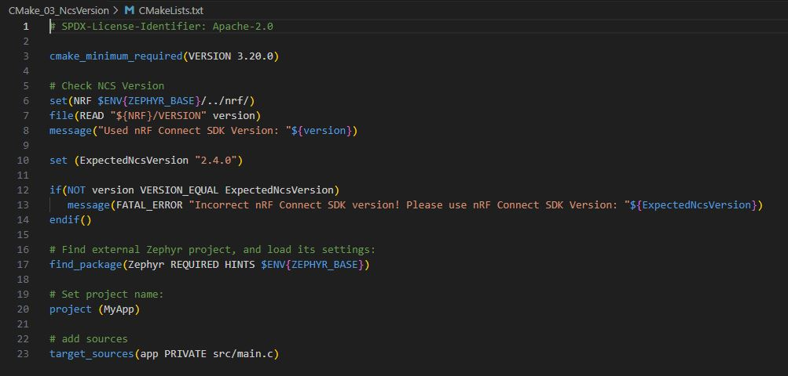
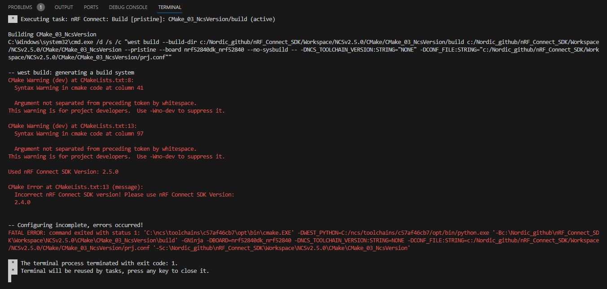

SDK version: NCS v2.5.0  -  Link to Hands-on solution: https://github.com/ChrisKurz/nRF_Connect_SDK/tree/main/Workspace/NCSv2.5.0/CMake/CMake_03_NcsVersion

# CMake: Checking _nRF Connect SDK_ Version in CMake

## Introduction

Sometimes it could be helpful to check the selected _nRF Connect SDK_ version during the build process and stop the build in case an incorrect version is used. Here is a description how this could be done. 

Note: further information about CMake can be found on [cmake.org](cmake.org).

## Required Hardware/Software for Hands-on
- one nRF52 development kit (e.g. nRF52DK, nRF52833DK, or nRF52840DK)
- install the _nRF Connect SDK_ v2.5.0 and _Visual Studio Code_. The description of the installation can be found [here](https://developer.nordicsemi.com/nRF_Connect_SDK/doc/2.5.0/nrf/getting_started/assistant.html#).

## Hands-on step-by-step description 

1) Let's start with the hello_world project. Add this project to your Visual Studio Code workspace. 

2) The check of _nRF Connect SDK_ version should happen early in the build process. So we add following lines after the __cmake_minimu_required()__ check was done in CMakeLists.txt file.

   CMakeLists.txt 

       # Check NCS Version
       set(NRF $ENV{ZEPHYR_BASE}/../nrf/)
       file(READ "${NRF}/VERSION" version)
       message("Used nRF Connect SDK Version: "${version})

   Here we read out the _nRF Connect SDK_ version, which is stored in the file __nrf/VERSION__.

3) Let's define the expected _nRF Connect SDK_ version as a variable. By this we only have to define the expected version number at one position.

   CMakeLists.txt 

       set (ExpectedNcsVersion "2.4.0")

4) Now check if the expected and the used version are identical. If not a fatal error is generated and an error message is shown.

   CMakeLists.txt 

       if(NOT version VERSION_EQUAL ExpectedNcsVersion)
          message(FATAL_ERROR "Incorrect nRF Connect SDK version! Please use nRF Connect SDK Version: "${ExpectedNcsVersion})
       endif()

So your CMakeLists.txt file should now look like this:

## Testing

5) Now build your project. You should see in the terminal the error message.

6) Change the ExpectedNcsVersion in __CMakeLists.txt__ file to "2.5.0" and build the project again. Now you only see the message that tells you which NCS version you are using. The build of the project is completely done. 
