SDK version: NCS v2.3.0

# Getting started: Creating a new Project from existing Sample

## Introduction

Here is an explanation of how to create your own project in your workspace folder based on an existing example. We will use Visual Studio Code here. 

## Required Hardware/Software
- install the _nRF Connect SDK_ v2.3.0 and _Visual Studio Code_. The description of the installation can be found [here](https://developer.nordicsemi.com/nRF_Connect_SDK/doc/2.3.0/nrf/getting_started/assistant.html#).

## Step-by-step description 

### Create you own project by copying an existing Sample to your own Workspace

1) First, start Visual Studio Code and click on the _nRF Connect_ extension. 

   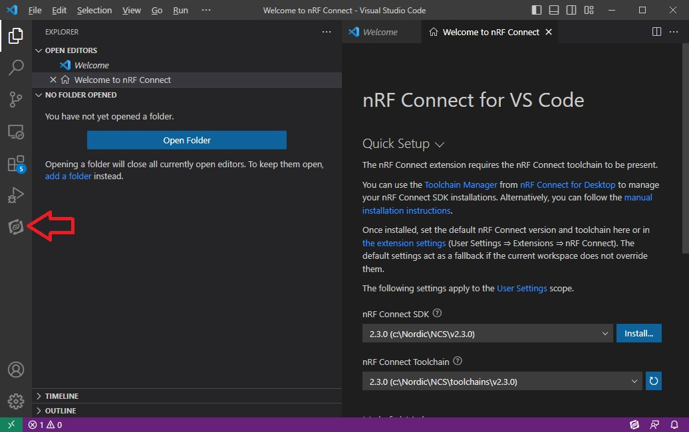

2) Then we click on _Create a new application_. 

    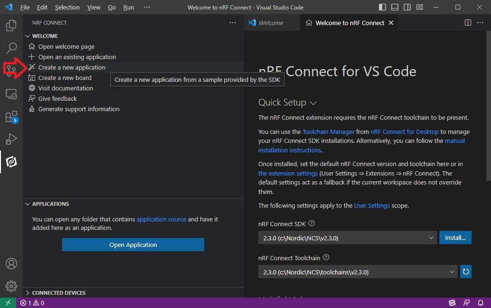

3) In the __New Application__ window select the Application type __Freestanding__. 

    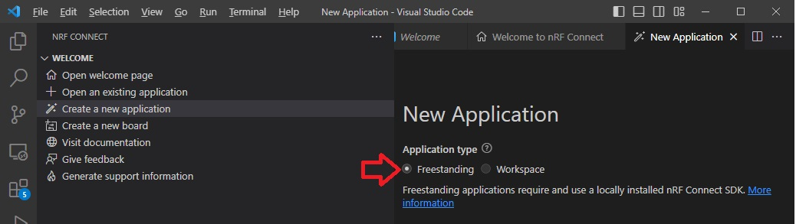

4) Select the _nRF Connect SDK_ and _nRF Connect Toolchain_ versions you would like to use. 

    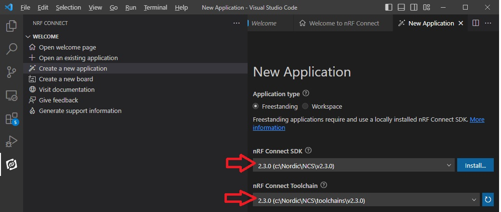
    
5) Define the Workspace folder. This is the folder where you will store all your projects. NOTE: Avoid to use spaces in the workspace name and place the Workspace folder close to the root directory (avoid long pathes here)!

    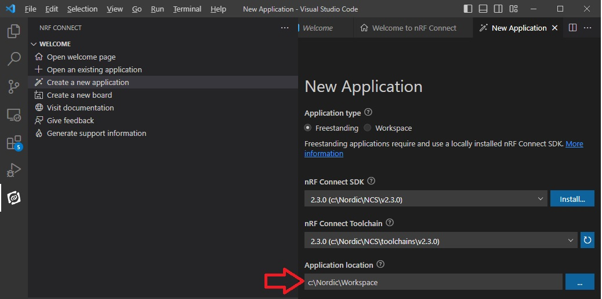

6) Now, select the application template. Here you can select onw of the samples that will be copied to your own workspace folder. 

    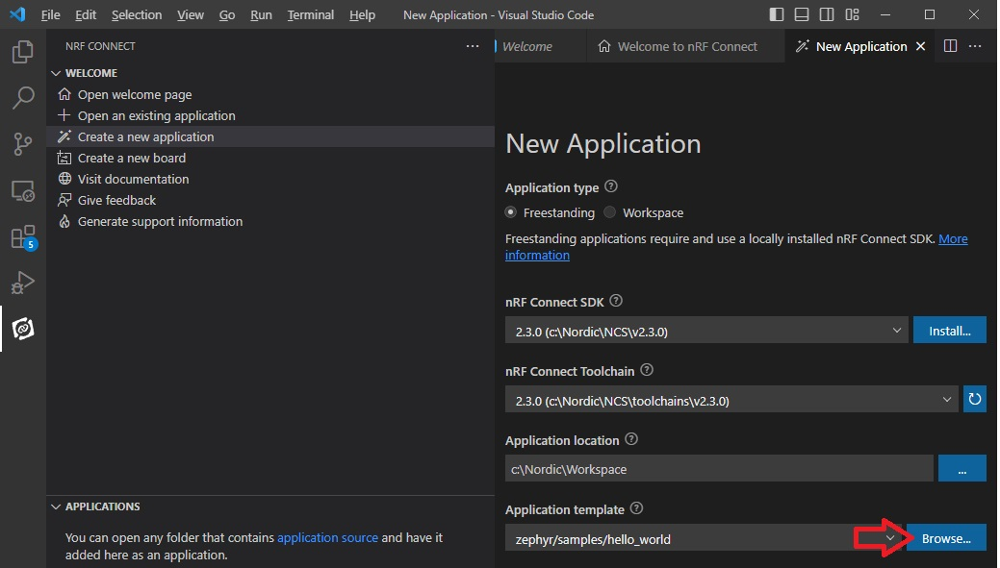
    
7) You can now select the sample that you would like to copy. Use the _Search_ field to look for the right sample. If you found the sample, click on it and then press the _Select_ button. 

    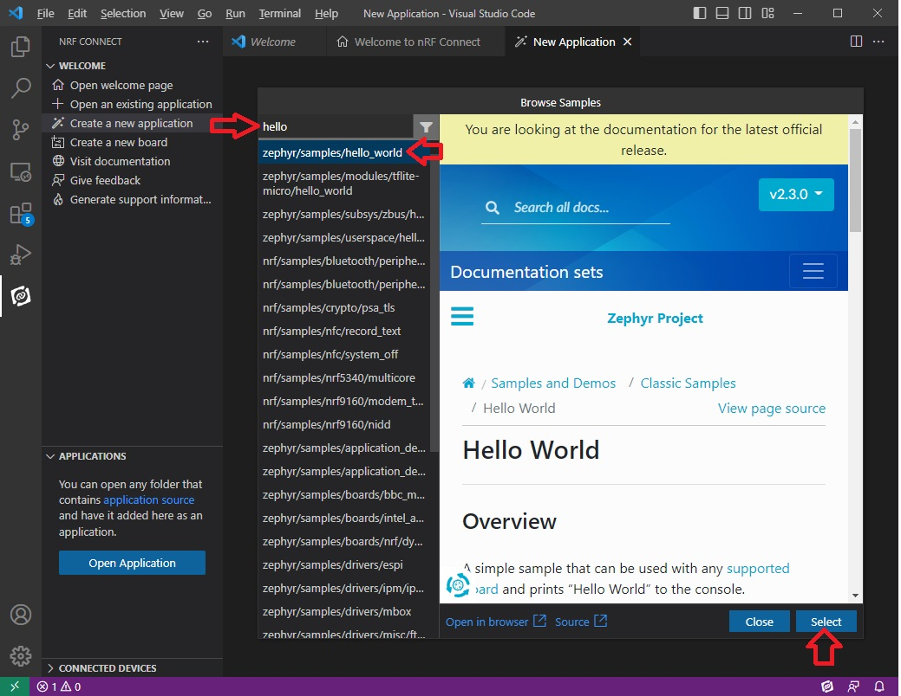

8) Define an _Application name_. The application name is the folder that will be created in your workspace folder. In case, there is already a folder with this name in your wokspace, you will see an error message. In this case select another application name. NOTE: Avoid to use spaces in the application name!

    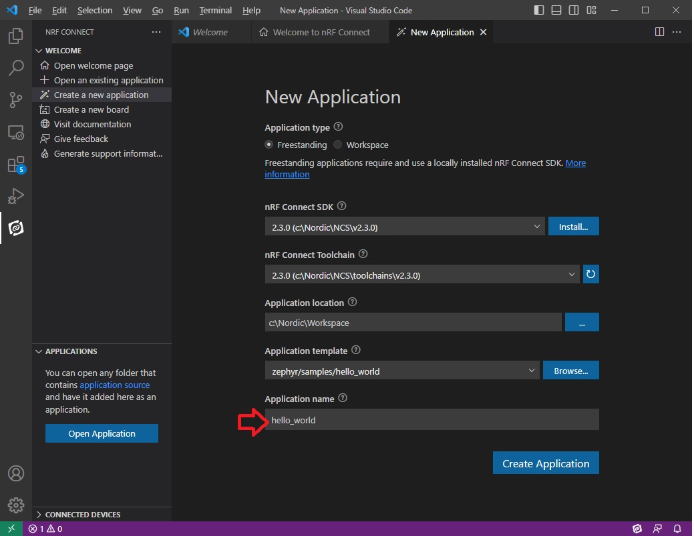

9) And now press the __Create Application__ button. 

    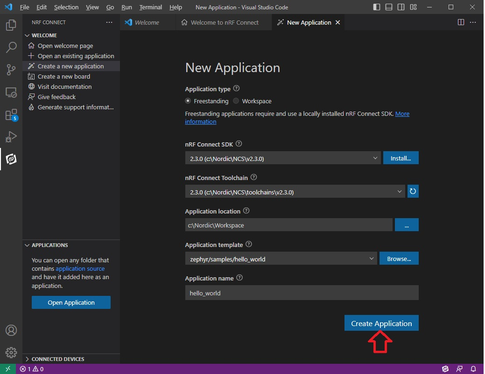

### Add a Build Configuration to your Project

10) You should now see the _hello_world_ project in the _nRF Connect_'s APPLICATIONS section. Now, we have to add a Build Configuration. This can be done by clicking the "Add Build Configuration" icon behind the project name (you have to move the mouse over the project name) or you just click the "Click to create one" text in the line __No build configurations__. 

   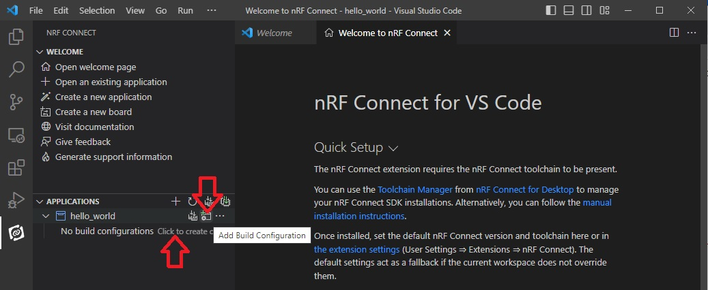
   
11) In the __Add Build Configuration__ window we define first the board that we will use. 

   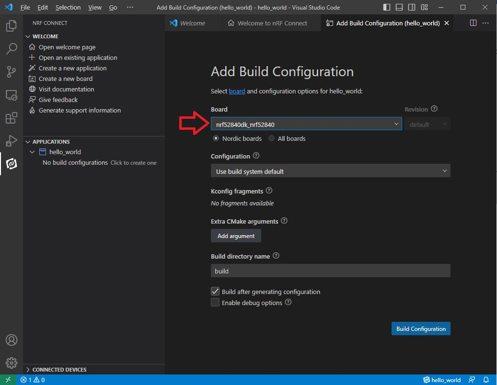
   
12) You can now also enable Debug options in case you would like to use it. 

   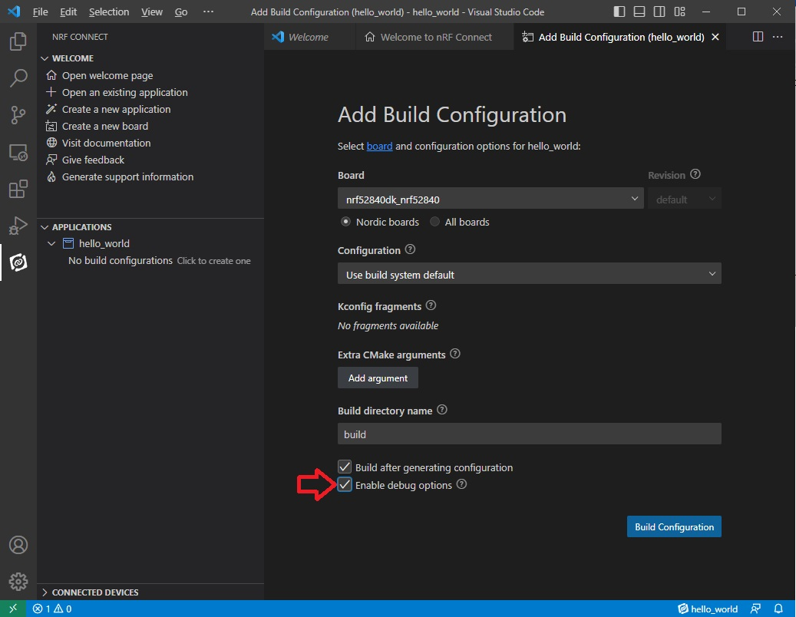
   
13) And finally click the __Build Configuration__ button. 

   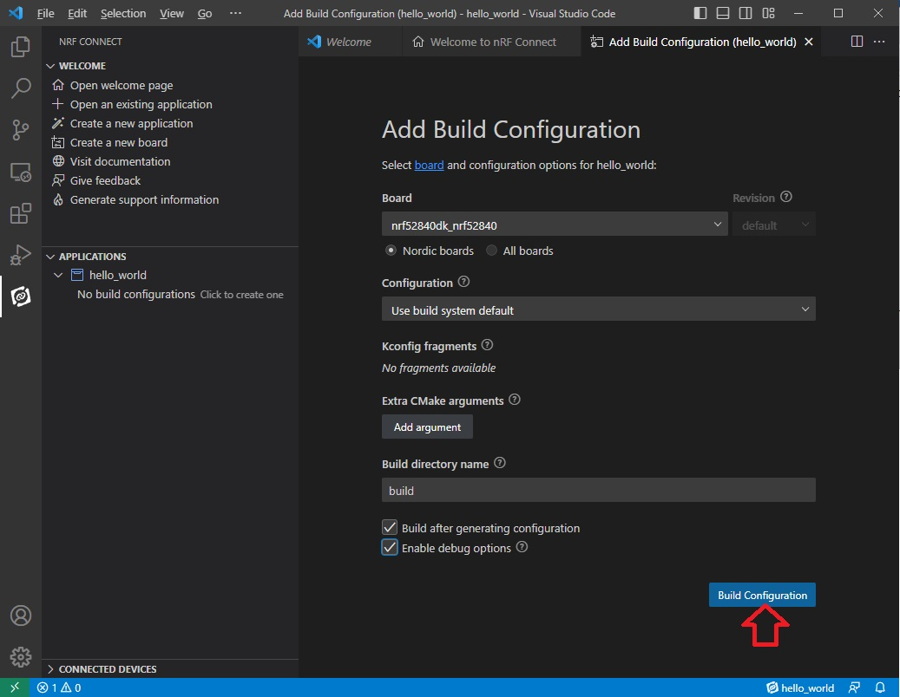
   

