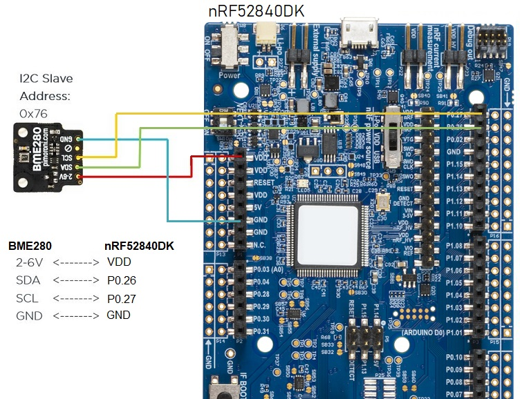
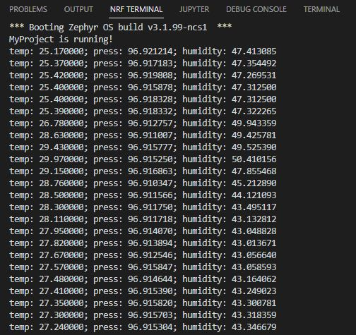

SDK version: NCS v2.3.0; Board: nRF52840DK; Directory with Solution: TBD

# Zephyr Device Driver: Adding BME280 Sensor Driver to a nRF52480 Project

There are plenty of drivers in the Zephyr RTOS. In this hands-on session we will take a closer look at the Sensor Drivers; specifically the BME280 sensor driver.

## Connect the BME280 Breakout Board to the nRF52840DK

1) First, please connect the BME280 Breakout Board to nRF52840DK as shown in the next picutre:

    

## DeviceTree: Define Hardware Usage in DeviceTree Files

2) Let's define the BME280 sensor as well as the used pins in an DeviceTree Overlay file. The Overlay file allows to overwrite definitions that are done in the pre-defined __nRF52840DK_nRF52840.dts__ board file. We will use the Arduino Shield I2C definition and modify it as described in the following text. 
 
    Create in the __C:/MyWorkspace/MyProject__ folder the file __nRF52840DK_nRF52840.overlay__ file. (IMPORTANT: ensure to use exactly this name, because with this name we overwrite the __nRF52840DK_nRF52840.dts__ file!)

    Then add following content to this file:

    _nRF52840DK_nRF52840.overlay_
    
       /* Configuration of a BME280 device on an Arduino I2C bus.
          -------------------------------------------------------
          Device Address 0x76 is used here. 
          Selected pins (Arduino I2C bus default pins - I2C0):
               SCL  ->  P0.27
               SDA  ->  P0.26
       */    
       &arduino_i2c {
               status = "okay";
               bme280@76 {
                       compatible = "bosch,bme280";
                       reg = <0x76>;
               };
       };

## Using the DeviceTree Definitions in our C-Code
In the previous step we defined the Hardware usage for the BME280 sensor. Now, we have to use these definitions in our C-code. This is done by following steps:

3) Get the device structure from the DeviceTree node with compatible "bosch,bme280". This is done by adding following line in main function:

    _src/main.c_ - add following lines in __void main(void)__ function:
    
           const struct device *dev = DEVICE_DT_GET_ANY(bosch_bme280);
           if (dev==NULL){
               /* No such node, or the node does not have status "okay". */
               printk("\nError: Device \"%s\" is not ready.\n", dev->name);
               /* You can also use Zephyr Logging instead of printk() instruction, if Logging is enabled in your project. */
               // LOG_ERR("Error: Device \"%s\" is not ready.", dev->name);
               return;
           }

    We use the __DEVICE_DT_GET_ANY__ macro here. This is a DeviceTree macro and it is defined in the __device.h__ header file. So we have to include this header file into our project. Add following line in __main.c__ file

    _src/main.c_ - add following line before __void main(void)__ function:
    
       #include <zephyr/device.h>

## KCONFIG: Adding BME280 Sensor Driver to Our Project

4) The required Software Modules can be added to our project by setting the appropriate CONFIG symbols (KCONFIG). Let's think about which software modules are needed:
    > - I2C: The BME280 itself supports I2C and SPI interface. Howwever, the breakout board is done in a way that only I2C is used. 
    > - Sensor: Include the sensor drivers to get access to the BME280 sensor driver. 

   So to enable these modules we have to add following lines to the __prj.conf__ file.
    
   _prj.conf_
    
       # Enable Software Modules for BME280 Sensor Driver Usage
       CONFIG_I2C=y
       CONFIG_SENSOR=y
    
## Using the BME280 Sensor Driver in our own Application
We have included the driver with the previous steps. Now we will use the driver in our own Application software. 

5) We keep our software quite simple and handle the sensor measurements in the main entire loop. So add following lines in the main function:

    _src/main.c_ - add following lines in __void main(void)__ function:
    
           while(1){
               struct sensor_value temp, press, humidity;
            
               sensor_sample_fetch(dev);
               sensor_channel_get(dev, SENSOR_CHAN_AMBIENT_TEMP, &temp);
               sensor_channel_get(dev, SENSOR_CHAN_PRESS, &press);
               sensor_channel_get(dev, SENSOR_CHAN_HUMIDITY, &humidity);
                
               printk("temp: %d.%06d; press: %d.%06d; humidity: %d.%06d\n",
                       temp.val1, temp.val2, press.val1, press.val2,
                       humidity.val1, humidity.val2);

               k_sleep(K_MSEC(1000));                
           }

6) We are using the functions __sensor_sample_fetch__ and __sensor_channel_get__ to trigger a measurement and read the conversion results. Usage of these functions requires its declaration. This is done in the __sensor.h__ header file. So we have to include it in our project. Add following line on top of our main.c file:

    _src/main.c_ - add following line before __void main(void)__ function:
    
       #include <zephyr/drivers/sensor.h>

## Build the project and Download to Development Kit

7) Click the "Build" button in the ACTIONS menu. 

8) Make sure that the connected kit is found and click __Flash__ in the ACTIONS menu. The code will now be downloaded to the kit. 

## Open Terminal and check Output

9) Open the terminal.
    
10) Reset the kit by pressing the Reset button on the board. The Zephyr boot message will be displayed in the terminal, followed by an optional application start output and the measurement results. 

    
