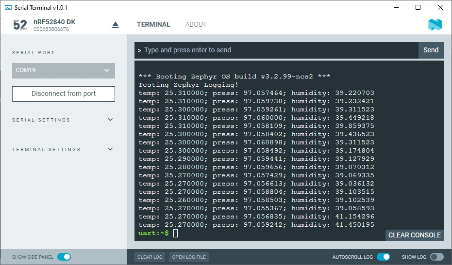

SDK version: NCS v2.3.0  -  Link to Hands-on solution: TBD

# Zephyr Kernel Services - Threads

## Introduction

In this exercise we will move the handling of the BME280 sensor into a Thread. 

## Required Hardware/Software
- one nRF52 development kit (e.g. nRF52DK, nRF52833DK, or nRF52840DK)
- BME280 board
- install the _nRF Connect SDK_ v2.3.0 and _Visual Studio Code_. The description of the installation can be found [here](https://developer.nordicsemi.com/nRF_Connect_SDK/doc/2.3.0/nrf/getting_started/assistant.html#).

## Hands-on step-by-step description 

### Create your own Project based on _hello_world_ Example

1) Create a new project based on our [BME280 example](https://github.com/ChrisKurz/nRF_Connect_SDK/blob/main/doc/NCSv2.3.0_ZDD_Sensors_BME280_nRF52840.md).

### Create first Thread (Thread_BME280)

This thread can be created during OS initialization. So we use the K_THREAD_DEFINE() macro to create a thread. 

2) Create the Thread by adding following lines in the main() function:

   _src/main.c_

       K_THREAD_DEFINE(
                  my_tid,              /* Name of the thread                          */
                  MYTHREAD_STACK_SIZE, /* Stack size in bytes                       */
                  Thread_BME280,       /* Thread entry function                       */
                  NULL, NULL, NULL,    /* Passing parameters for entry point function */
                  MYTHREAD_PRIORITY,   /* Thread priority                             */
                  0,                   /* Thread options                              */
                  0);                  /* Scheduling delay (0 for no delay)           */

3) We have to define here also the stack size.

   _src/main.c_

       #define MYTHREAD_STACK_SIZE 500

4) Remove the BME280 sensor handling in the main loop. (Sensor DeviceTree handling as well as triggering measurments and output results)

6) The complete BME280 sensor handling is done in a Thread.  

   _src/main.c_ 

       void Thread_BME280(void *arg1, void *arg2, void *arg3) {
           struct sensor_value temp, press, humidity;

           const struct device *dev = DEVICE_DT_GET_ANY(bosch_bme280);
           if (dev==NULL){
               /* No such node, or the node does not have status "okay". */
               printk("\nError: Device \"%s\" is not ready.\n", dev->name);
               /* You can also use Zephyr Logging instead of printk() instruction, if Logging is enabled in your project. */
               // LOG_ERR("Error: Device \"%s\" is not ready.", dev->name);
               return;
           }

           while(1) {
               sensor_sample_fetch(dev);
               sensor_channel_get(dev, SENSOR_CHAN_AMBIENT_TEMP, &temp);
               sensor_channel_get(dev, SENSOR_CHAN_PRESS, &press);
               sensor_channel_get(dev, SENSOR_CHAN_HUMIDITY, &humidity);
         
               printk("temp: %d.%06d; press: %d.%06d; humidity: %d.%06d\n",
                       temp.val1, temp.val2, press.val1, press.val2,
                       humidity.val1, humidity.val2);

               k_sleep(K_MSEC(1000)); 
           }
       }

6) And finally, define the Thread priority. 

   _src/main.c_

       #define MYTHREAD_PRIORITY 5

 

## Testing

7) Download the project to the connect nRF52 development board. Use a terminal program to check the debug ouptut. You should see something like this:

   
