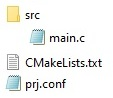
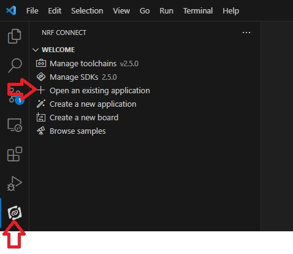
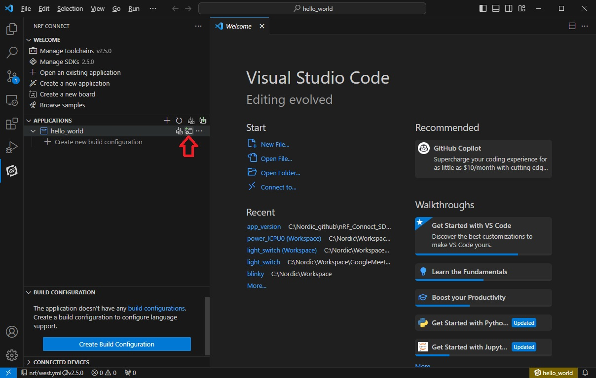
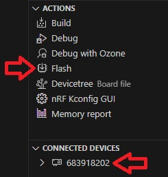
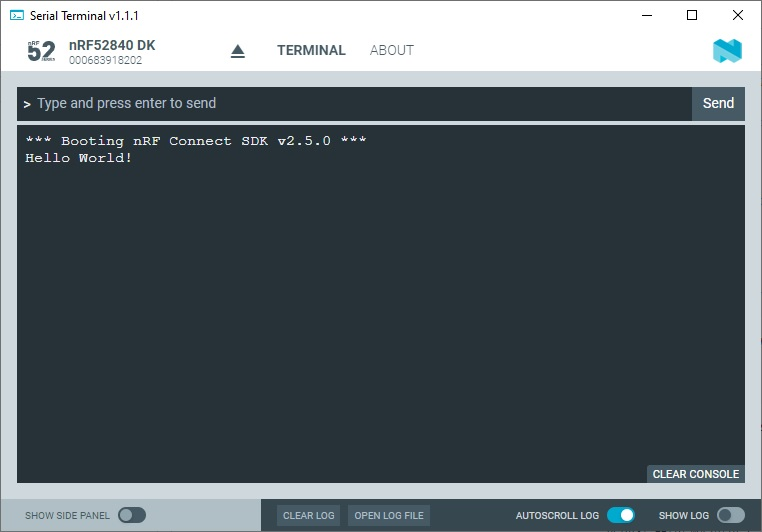

SDK version: NCS v2.5.0  -  Link to Hands-on solution: https://github.com/ChrisKurz/nRF_Connect_SDK/tree/main/Workspace/NCSv2.5.0/hello_world

# Getting started: Creating a Project from Scratch

## Introduction

Creating a project from scratch is quite simple with Zephyr. Here is a description how to create the simplest version of a project. We use Visual Studio Code in this example.

## Required Hardware/Software
- one nRF52 development kit (e.g. nRF52DK, nRF52833DK, or nRF52840DK)
- install the _nRF Connect SDK_ v2.5.0 and _Visual Studio Code_. The description of the installation can be found [here](https://developer.nordicsemi.com/nRF_Connect_SDK/doc/2.5.0/nrf/getting_started/assistant.html#).

## Hands-on step-by-step description 

### Create needed Folders and Files

1) First, create a Workspace directory outside the NCS folder. This will be the folder where all the future projects will be created. For example:   C:/Nordic/Workspace

2) Our first project is "Hello World". So we create a project folder __hello_world__ in our workspace directory:    C:/Nordic/Workspace/hello_world

    NOTE: Folder name should start with a letter and there should be no spaces in the folder name!

3) We need the following files in our project folder:

   

   NOTE: You can create these files in Windows File Explorer as follow: open a folder, then click inside this folder with the right mouse button. In context menu select "New" and "Text Document". It is important that the file extension is also changed for some files! You have to enable the file name extensions in the Windows File Explorer menu "View" and ensure a tick is set at "File name extensions".

4) Create the following three files in our project directory:

    _c:/Nordic/Workspace/hello_world/CMakeLists.txt_
    
       # SPDX-License-Identifier: Apache-2.0

       cmake_minimum_required(VERSION 3.20.5)

       # Find external Zephyr project, and load its settings:
       find_package(Zephyr REQUIRED HINTS $ENV{ZEPHYR_BASE})

       # Set project name:
       project (MyApp)

       # add sources
       target_sources(app PRIVATE src/main.c)             

    _c:/Nordic/Workspace/hello_world/prj.conf_
    
       # This line is just a comment. In this simple project we can use the default configuration. 
       
    and create main.c in the subfolder _src_ ->
         _c:/Nordic/Workspace/hello_world/src/main.c_
    
       #include <zephyr/kernel.h>

       int main(void)
       {
            printk("Hello World!\n");

            return 0;
       }

   NOTE: In the __main.c__ file we use the _printk()_ instruction. To be able to use this function, we must insert the line __#include <zephyr/sys/printk.h>__. Please note that the header file __kernel.h__ also includes other header files, such as the __printk.h__ file. For this reason, we only include the __kernel.h__ file in the main.c file above.

## Testing

5) Start Visual Studio Code. 

6) Click on "+ Open an existing application" and select the __hello_world__ folder. (our project folder is the folder where CMakeLists.txt and prj.conf files are stored.)

   

7) Before we can work on our project we have to __Add build configuration__. This is done by clicking the folder icon behind our project in the APPLICATIONS section. You can also click on the line "+ Create new build configuration" instead of clicking the icon.

   

9) In the __Board__ drop down list enter the board name of your development kit. When you enter the name you should see that the list will be filtered. 

   NOTE: Beside the developement kit name, the board name mentions also a chip name. This is done, because smaller devices may be emulated by using bigger devices. For example, the board name "nRF52840DK_nRF52811" shows that the nRF52840DK kit is used to emulate an nRF52811.

10) Let's use the default settings for the rest. Click __Generate Config__ button.

11) After the project build is completed, check all the available files in the hello_world folder.

   

11) Ensure that the connected kit is found and click __Flash__ in the ACTIONS menu. The code download is downloaded to the kit. 

   

12) Open a terminal program, for example the _Serial Terminal_ that is available in _nRF Connect for Desktop_
 
   Settings: 115200 baud, 8 data bits, 1 stop bit, no parity, no flow control)

13) reset the kit. The Zephyr boot message and "Hello World" string is shown in the terminal. 

   
