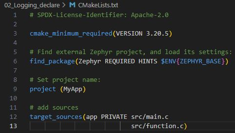
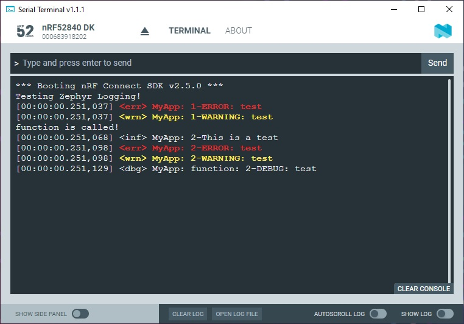

SDK version: NCS v2.5.0  -  Link to Hands-on solution: https://github.com/ChrisKurz/nRF_Connect_SDK/tree/main/Workspace/NCSv2.5.0/02_Logging_declare

# Zephyr Logging - In Case the Software Module consists of multiple Files

## Introduction

In order to use logging in the module, a unique name of a module must be specified and module must be registered using LOG_MODULE_REGISTER. We have used this in the [previous hands-on](NCSv2.5.0_02_ZephyrLogging.md). 

If the module consists of multiple files, then LOG_MODULE_REGISTER() should appear in exactly one of them. Each other file should use LOG_MODULE_DECLARE to declare its membership in the module. This case is described in the hands-on on this page.

## Required Hardware/Software for Hands-on
- one nRF52 development kit (e.g. nRF52DK, nRF52833DK, or nRF52840DK)
- install the _nRF Connect SDK_ v2.5.0 and _Visual Studio Code_. The description of the installation can be found [here](https://developer.nordicsemi.com/nRF_Connect_SDK/doc/2.5.0/nrf/getting_started/assistant.html#).

## Hands-on step-by-step description 

### Copy Zephyr Logging Project

1) Let's make a copy of the previous zephyr Logging hands-on project. The previous project can also be found [here](https://github.com/ChrisKurz/nRF_Connect_SDK/tree/main/Workspace/NCSv2.5.0/02_Logging). 

### Add another C File to the project

2) Let's add another C file to your project. So in src folder add the file _functions.c_. 

3) We have to include this file via the CMakeLists.txt file. So add the _src/function.c_ file name to the target_source list. The CMakeLists.txt file should then look like this:

   

4) The function.c is still blank. Let's add some dummy code.

   __src/function.c__
   
       #include <zephyr/kernel.h>
       
       void function(void) {
          printk("function is called!\n");   
   
       }

5) We have to declare the new, extern function im main.c file. 

   __src/main.c__
   
       extern void function(void);

6) And we should call the new function in main() function.

   __src/main.c__ => main() function

           function();

### Include the New Function File in our Module and use the same Zephyr Logging Registration 
   
7) To show that the new function belongs to the same software module as our file where Zephyr Logging has already been registered, a Logging declaration is added to the new file. We do this by inserting the following lines into our new function.c file.

   __src/function.c__

       #include <zephyr/logging/log.h>
       
       LOG_MODULE_DECLARE(MyApp, LOG_LEVEL_DBG);

   __NOTE__: We have to use the same software module name in the LOG_MODULE_DECLARE() macro. So in our main.c function we used "MyApp" when the LOG_MODULE_REGISTRATION was done. The second parameter in the LOG_MODULE_DECLARE macro is the log level. Default log level (CONFIG_LOG_DEFAULT_LEVEL) is used if custom log level is not provided. In our example we have set the log level for the function.c file to LOG_LEVEL_DBG. Note that it can be different than the definition in the main.c file.

8) To test if the Logging now works in the new file we will simply add some log output to the function.

   __src/function.c__

           LOG_INF("2-This is a test");
           LOG_ERR("2-ERROR: test");
           LOG_WRN("2-WARNING: test");
           LOG_DBG("2-DEBUG: test");

## Testing

9) Build and flash the project to your development kit. 

10) Use a terminal program on your computer and check the output. Note that some lines are printed after a reset. So you may press the RESET button to see it. 

   

   What you can see here is that the same "MyApp" software module is used here as output module and that the log level of the new C file is set differently than in the main file.
   
