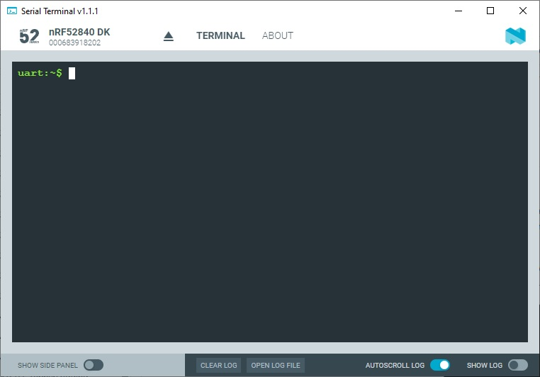
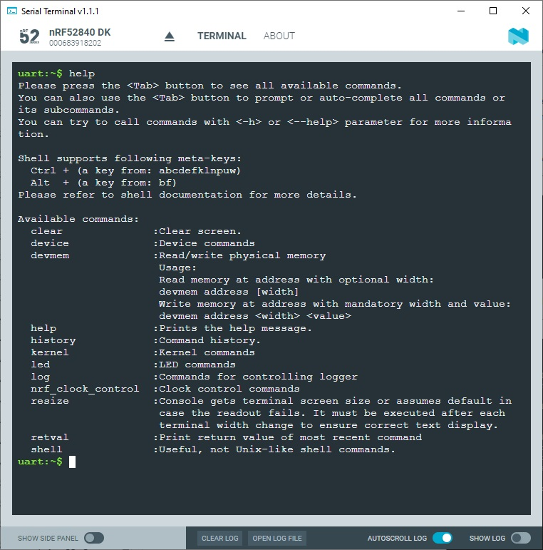
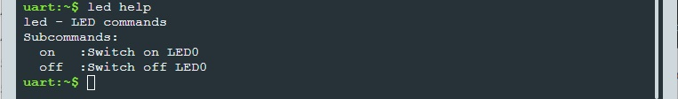
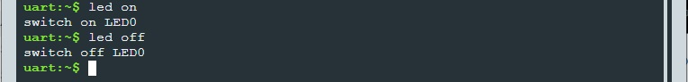

SDK version: NCS v2.5.0  -  Link to Hands-on solution: https://github.com/ChrisKurz/nRF_Connect_SDK/tree/main/Workspace/NCSv2.5.0/10_Shell

# Zephyr OS Service: Shell

## Introduction

This module allows you to create and handle a shell with a user-defined command set. You can use it in examples where more than simple button or LED user interaction is required. This module is a Unix-like shell with these features:

- Support for multiple instances.
- Advanced cooperation with the Logging.
- Support for static and dynamic commands.
- Support for dictionary commands.
- Smart command completion with the Tab key.
- Built-in commands: clear, shell, colors, echo, history and resize.
- Viewing recently executed commands using keys: ↑ ↓ or meta keys.
- Text edition using keys: ←, →, Backspace, Delete, End, Home, Insert.
- Support for ANSI escape codes: VT100 and ESC[n~ for cursor control and color printing.
- Support for editing multiline commands.
- Built-in handler to display help for the commands.
- Support for wildcards: * and ?.
- Support for meta keys.
- Support for getopt and getopt_long.
- Kconfig configuration to optimize memory usage.

## Required Hardware/Software for Hands-on
- one nRF52 development kit (e.g. nRF52DK, nRF52833DK, or nRF52840DK)
- install the _nRF Connect SDK_ v2.5.0 and _Visual Studio Code_. The description of the installation can be found [here](https://developer.nordicsemi.com/nRF_Connect_SDK/doc/2.5.0/nrf/getting_started/assistant.html#).

## Hands-on step-by-step description 

### Create a new Project

1) Create a new project based on blinky (/zephyr/samples/basic/blinky)

### Add needed Software Modules

2) Now we have to add the Zephyr Logging and Zephyr Shell software modules to our project. Add following lines in _prj.conf_ file:

	_prj.conf_

       # Enable Zephyr Logging
       CONFIG_LOG=y

       # Enable Zephyr Shell
       CONFIG_SHELL=y

3) We have to include the Zephyr Shell header file in _main.c_ file:

	_src/main.c_

       #include <zephyr/shell/shell.h>

### Define new Shell Commands

4) We add two commands to the shell, which allows us to switch on and off the LED0. Add following lines in main.c:

	_src/main.c_

       /* Creating subcommands (level 1 command) array for command "led". */
       SHELL_STATIC_SUBCMD_SET_CREATE(sub_led,
               SHELL_CMD(on, NULL, "Switch on LED0", cmd_led_on),
               SHELL_CMD(off, NULL, "Switch off LED0", cmd_led_off),
               SHELL_SUBCMD_SET_END
       );
       /* Creating root (level 0) command "led" */
       SHELL_CMD_REGISTER(led, &sub_led, "LED commands", NULL);

5) Instead, we define the functions that should be executed if the appropriate shell command is entered:

	_src/main.c_

       static int cmd_led_on(const struct shell *shell, size_t argc, char **argv)
       {
          ARG_UNUSED(argc);   
          ARG_UNUSED(argv);

          printk("switch on LED0\n");
          gpio_pin_set_dt(&led,1);
          return 0;
       }

       static int cmd_led_off(const struct shell *shell, size_t argc, char **argv)
       {
           ARG_UNUSED(argc);   
           ARG_UNUSED(argv);

           printk("switch off LED0\n");
           gpio_pin_set_dt(&led,0);
           return 0;
       }

### Clean up the Code

6) __Remove__ these lines from the original blinky example:

   

## Testing

7) Build the project and download to an nRF52 development kit (e.g. nRF52840-DK).

8) Ensure the code is executed on your development kit. This can be done by connecting the development kit via USB to your computer and opening a terminal program (e.g. Putty, TeraTerm, or Nordic's _Serial Terminal_). Terminal program settings:  115200 baud, 8 data bits, 1 stop bit, no parity, no flow control

   You should see following output in the terminal:
   
   

9) Enter the command "help". You should see a list of supported shell commands. 

   

10) You can also get more information about these commands by entering "led help":

   

11) Switch on/off the LED by entering following commands:

         LED on

   or

         LED off

   
   
