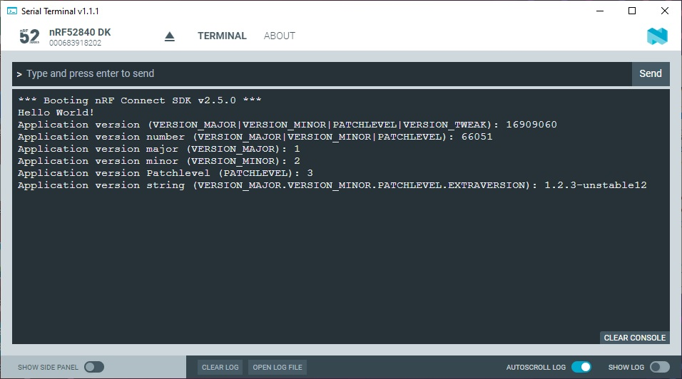

SDK version: NCS v2.5.0  -  Link to Hands-on solution: https://github.com/ChrisKurz/nRF_Connect_SDK/tree/main/Workspace/NCSv2.5.0/app_version

# Application Version Management

## Introduction

Note that the Application Version Management is a functionality that was first time included in _nRF Connect SDK version 2.5.0_!

We have already talked about how to handle the [Zephyr Version](https://github.com/ChrisKurz/nRF_Connect_SDK/blob/main/doc/NCSv2.4.0_ZKS_Other_01_version.md). Beside that, it is also interesting to realize a version handling from the application firmware. Zephyr supports this with the [application Version management](https://developer.nordicsemi.com/nRF_Connect_SDK/doc/2.5.0/zephyr/build/version/index.html).

In this hands-on we will use the application version management. 

## Required Hardware/Software
- one nRF52 development kit (e.g. nRF52DK, nRF52833DK, or nRF52840DK)
- install the _nRF Connect SDK_ v2.5.0 and _Visual Studio Code_. The description of the installation can be found [here](https://developer.nordicsemi.com/nRF_Connect_SDK/doc/2.5.0/nrf/getting_started/assistant.html#).

## Hands-on step-by-step description 

### Create a new Project

1) Make a copy of the "hello_world" project. Here is the link to this project: https://github.com/ChrisKurz/nRF_Connect_SDK/tree/main/Workspace/NCSv2.5.0/hello_world

### Add Application Version File

2) A new file is needed within the project folder. So add a file __version__ (no extension in file name!) in the path where also the __CMakeLists.txt__ file is located.

	_version_ 

       VERSION_MAJOR = 1
       VERSION_MINOR = 2
       PATCHLEVEL = 3
       VERSION_TWEAK = 4
       EXTRAVERSION = unstable12

  NOTE: Use numbers for VERSION_MAJOR, VERSION_MINOR, PATCHLEVEL, and VERSION_TWEAK. You can use alphanumerical characters (lowercase a-z and 0-9) for EXTRAVERSION. 

### Use in C Code

3) To use the version information in application code, you must first include the version file. Add the following line in main.c file:

	_src/main.c_

       #include "app_version.h"

4) Then the version numbers of the application can be read out using the defines shown in this example:

	_src/main.c_ => main() function

            printk("Application version (VERSION_MAJOR|VERSION_MINOR|PATCHLEVEL|VERSION_TWEAK): %s\n", APPVERSION);
            printk("Application version number (VERSION_MAJOR|VERSION_MINOR|PATCHLEVEL): %s\n", APP_VERSION_NUMBER);
            printk("Application version major (VERSION_MAJOR): %i\n", APP_VERSION_MAJOR);
            printk("Application version minor (VERSION_MINOR): %i\n", APP_VERSION_MINOR);
            printk("Application version Patchlevel (PATCHLEVEL): %i\n", APP_PATCHLEVEL);
            printk("Application version string (VERSION_MAJOR.VERSION_MINOR.PATCHLEVEL.EXTRAVERSION): %s\n", APP_VERSION_STRING);
            printk("Application build version: %s\n", APP_BUILD_VERSION);

## Testing
5) Build the project and donwload it to your development kit. 
6) In the terminal you should see following outuput:

   

Note: You can read the application version and application version number better if you convert them to hexadecimal. 

  16909060 (decimal) = 0x01020304 (hexadecimal)

  66051 (decimal) = 0x010203 (hexadecimal)
