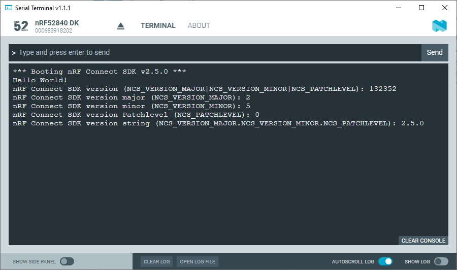

SDK version: NCS v2.5.0  -  Link to Hands-on solution: https://github.com/ChrisKurz/nRF_Connect_SDK/tree/main/Workspace/NCSv2.5.0/ncs_version

# nRF Connect SDK Version 

## Introduction

Maybe you want also to read out the version number of the used _nRF Conned SDK_. This hands-on describes how this can be done. 

## Required Hardware/Software
- one nRF52 development kit (e.g. nRF52DK, nRF52833DK, or nRF52840DK)
- install the _nRF Connect SDK_ v2.5.0 and _Visual Studio Code_. The description of the installation can be found [here](https://developer.nordicsemi.com/nRF_Connect_SDK/doc/2.5.0/nrf/getting_started/assistant.html#).

## Hands-on step-by-step description 

### Create a new Project

1) Make a copy of the "hello_world" project. Here is the link to this project: https://github.com/ChrisKurz/nRF_Connect_SDK/tree/main/Workspace/NCSv2.5.0/hello_world

### Use in C Code

2) To use the version information in application code, you must first include the _nRF Connect SDK_ version file. Add the following line in main.c file:

	_src/main.c_

       #include "ncs_version.h"

3) Then the version numbers of the _nRF Connect SDK_ can be read out using the defines shown in this example:

	_src/main.c_ => main() function

            printk("nRF Connect SDK version (NCS_VERSION_MAJOR|NCS_VERSION_MINOR|NCS_PATCHLEVEL): %d\n", NCS_VERSION_NUMBER);
            printk("nRF Connect SDK version major (NCS_VERSION_MAJOR): %i\n", NCS_VERSION_MAJOR);
            printk("nRF Connect SDK version minor (NCS_VERSION_MINOR): %i\n", NCS_VERSION_MINOR);
            printk("nRF Connect SDK version Patchlevel (NCS_PATCHLEVEL): %i\n", NCS_PATCHLEVEL);
            printk("nRF Connect SDK version string (NCS_VERSION_MAJOR.NCS_VERSION_MINOR.NCS_PATCHLEVEL): %s\n", NCS_VERSION_STRING);

## Testing
4) Build the project and donwload it to your development kit. 
5) In the terminal you should see following outuput:

   

Note: You can read the nRF Connect SDK version number better if you convert them to hexadecimal. 

  132352 (decimal) = 0x020500 (hexadecimal)
