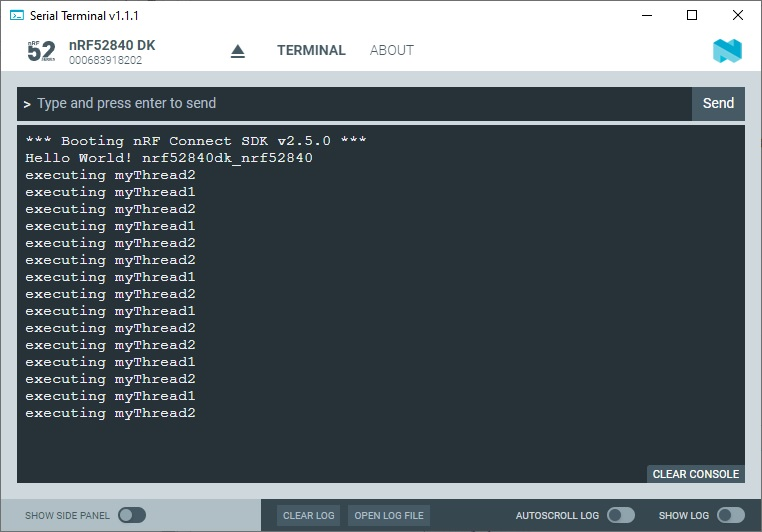

SDK version: NCS v2.5.0  -  Link to Hands-on solution: https://github.com/ChrisKurz/nRF_Connect_SDK/tree/main/Workspace/NCSv2.5.0/ZKS_Threads_create

# Zephyr Kernel Services - Threads

## Introduction

This example demonstrates how to create threads. There are two ways to create a thread. So we will use both. 

## Required Hardware/Software
- one nRF52 development kit (e.g. nRF52DK, nRF52833DK, or nRF52840DK)
- install the _nRF Connect SDK_ v2.5.0 and _Visual Studio Code_. The description of the installation can be found [here](https://developer.nordicsemi.com/nRF_Connect_SDK/doc/2.5.0/nrf/getting_started/assistant.html#).

## Hands-on step-by-step description 

### Create your own Project based on _hello_world_ Example

1) Create a new project based on Zephyr's _hello_world_ example (./zephyr/samples/hello_world).

2) The Zephyr _hello_world_ example does not include the __zephyr/kernel.h__ header file. We add this include in the main.c file:

   _src/main.c_ 

       #include <zephyr/kernel.h>

### Create first Thread (myThread1)

Here we will create an new thread during runtime. This way may be used to create a new thread during application code execution. 

3) Create the Thread by adding following lines in the main() function:

   _src/main.c_ => main() function
   
           k_tid_t my_tid1 = k_thread_create(
                  &myThread1_data,    /* Thread Control Block                        */
                  mythread1_stack_area, /* Stack Area                                */
                  K_THREAD_STACK_SIZEOF(mythread1_stack_area),
                  myThread1,          /* Thread Entry Function                       */
                  NULL, NULL, NULL,   /* Passing parameters for entry point function */
                  MYTHREAD1_PRIORITY, /* Thread priority                             */
                  0,                  /* Thread options                              */
                  K_NO_WAIT);         /* Scheduling delay (K_NO_WAIT for no delay)   */

4) Some of these parameters have to be defined now. Let's start with _my_thread_data_. Here we have to define a Variable based on __k_thread__ type. 

   _src/main.c_

       struct k_thread myThread1_data;

5) Beside this, we also have to define the stack area for the thread. 

   _src/main.c_

       #define MYTHREAD1_STACK_SIZE 500

       K_THREAD_STACK_DEFINE(mythread1_stack_area, MYTHREAD1_STACK_SIZE);

6) The code that is processed with respect to this thread is written in a function. When creating the thread, the entry point address of this function is given. 

   _src/main.c_

       void myThread1(void *arg1, void *arg2, void *arg3) {
        
           while(1) {
               k_msleep(1000);
               printk("executing myThread1\n");
           }
       }

7) And finally, the thread priority has to be defined.

   _src/main.c_

       #define MYTHREAD1_PRIORITY 5

### Create second Thread (myThread2)

In case the thread can be created during OS initialization, then using the K_THREAD_DEFINE() macro is another possibility to create a thread. 

8) Create the Thread by adding following lines in the main() function:

   _src/main.c_

       K_THREAD_DEFINE(
                  my_tid2,            /* Name of the thread                          */
                  MYTHREAD2_STACK_SIZE, /* Stack size in bytes                       */
                  myThread2,          /* Thread entry function                       */
                  NULL, NULL, NULL,   /* Passing parameters for entry point function */
                  MYTHREAD2_PRIORITY, /* Thread priority                             */
                  0,                  /* Thread options                              */
                  0);                 /* Scheduling delay (0 for no delay)           */

9) We have to define here also the stack size.

   _src/main.c_

       #define MYTHREAD2_STACK_SIZE 500

10) Let's define the Thread function. 

   _src/main.c_ 

       void myThread2(void *arg1, void *arg2, void *arg3) {
        
           while(1) {
               k_msleep(700);
               printk("executing myThread2\n");
           }
       }

11) And finally, define the Thread priority. 

   _src/main.c_

    #define MYTHREAD2_PRIORITY 5

 

## Testing

12) Download the project to the connect nRF52 development board. Use a terminal program to check the debug ouptut. You should see something like this:

   
   
   Thread 1 is printing each second, while Thread 2 is printing each 700 ms. That's why Thread 2 is sometimes output twice in a row. 
