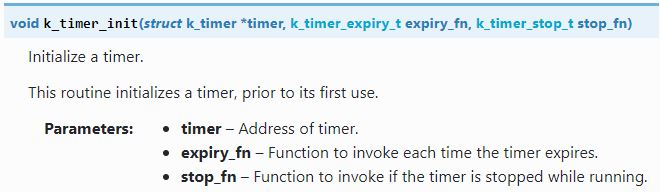
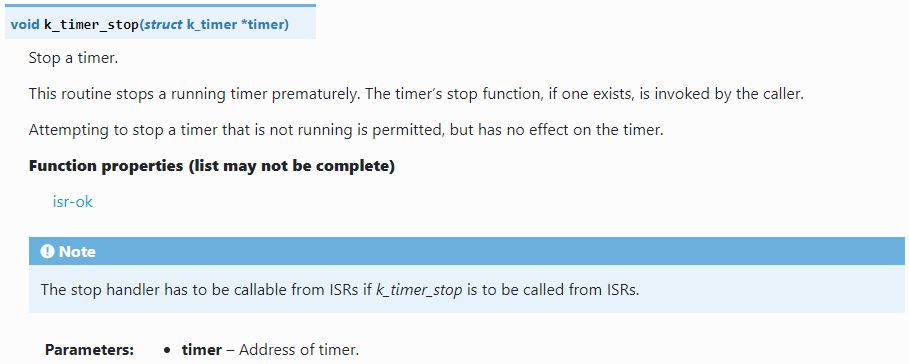
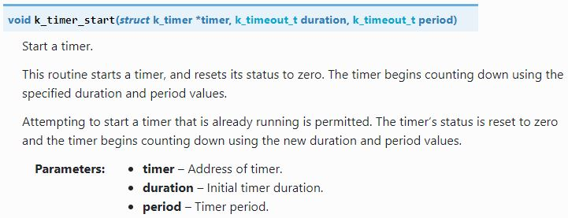
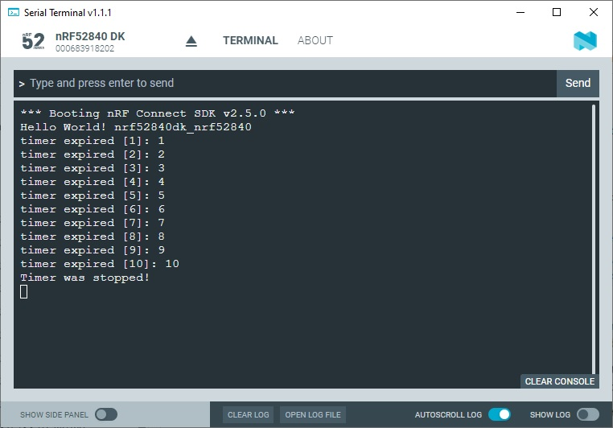

SDK version: NCS v2.5.0  -  Link to Hands-on solution: https://github.com/ChrisKurz/nRF_Connect_SDK/tree/main/Workspace/NCSv2.5.0/ZKS_Timing_Timer

# Zephyr Kernel Services: Timing - Timers

## Introduction

The Zephyr kernel provides a _Timer_ object that can be used to generate timings. The _Timer_ object uses the system clock and generates callback function calls when the timer expires or when it is stopped. 

## Required Hardware/Software for Hands-on
- one nRF52 development kit (e.g. nRF52DK, nRF52833DK, or nRF52840DK)
- install the _nRF Connect SDK_ v2.5.0 and _Visual Studio Code_. The description of the installation can be found [here](https://developer.nordicsemi.com/nRF_Connect_SDK/doc/2.5.0/nrf/getting_started/assistant.html#).

## Hands-on step-by-step description 

### Create a new Project

1) Create a new application. Use the zephyr/samples/hello_world sample. 

### Define k_timer Variable

2) The number of timers that can be created is limited only by the amount of ram available. For each timer a variable of type _k_timer_ must be defined. Each timer is referenced by its memory address. So let's define this variable:

 	_src/main.c_   
   
       struct k_timer MyTimer;

### Initialize the Timer

3) Now we will initialize the timer by calling _k_timer_init()_ function: 
  
  _src/main.c_ => main() function   
  
        k_timer_init(&MyTimer, TimerExpire, TimerStopped);

   _k_timer_init()_ function description:
   
   
   
   https://docs.nordicsemi.com/bundle/ncs-2.5.0/page/zephyr/kernel/services/timing/timers.html#c.k_timer_init

### Define expireation callback function

4) In the timer initialization we also defined a callback function, which should be called as soon as the timer expires. So we have to add this function.

  _src/main.c_   
  
    static void TimerExpire(struct k_timer *timer) {
        static uint16_t count;
    
        count++;
        printk("timer expired [%d]: %u\n",count, timer->status);
           
        if (count == 10)
            k_timer_stop(timer);
    }

   _k_timer_stop()_ function description:
   
   
   
   https://docs.nordicsemi.com/bundle/ncs-2.5.0/page/zephyr/kernel/services/timing/timers.html#c.k_timer_stop

### Define stop timer callback function

5) And there is another callback function that has to be called as soon as the timer was stopped. 

  _src/main.c_   

    static void TimerStopped(struct k_timer *timer) {
        printk("Timer was stopped!\n");       
    }

### Start Timer

6) The timer was not yet started. This is done with following line:

  _src/main.c_ => main() function   

        k_timer_start(&MyTimer, K_MSEC(5000), K_MSEC(1000)); // wait 5 seconds, period 1 second
       
   _k_timer_start()_ function description:
   
   
   
   https://docs.nordicsemi.com/bundle/ncs-2.5.0/page/zephyr/kernel/services/timing/timers.html#c.k_timer_start
       
       
## Testing

7) Build the project.
8) Open a terminal program (e.g. Putty - 115200 baud, 8 data bits, 1 stop bit, no flow control).
9) Flash the project to your development kit. 
10) Check the output in your terminal program. You should see something like this:

   
   
   Note that first timer expiration should happen around 5 seconds after program start. Afterwards you should see timer expiration each second.
   

