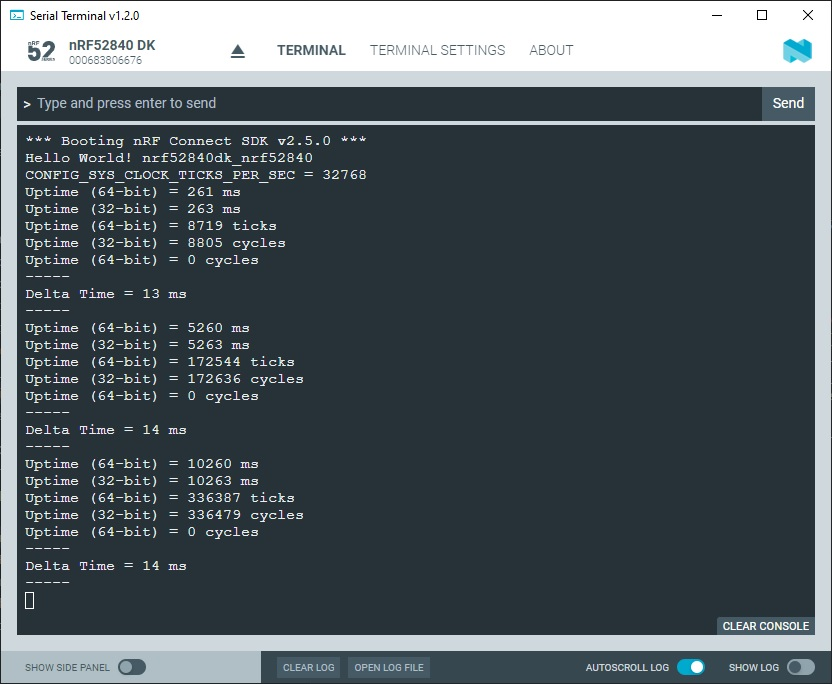

SDK version: NCS v2.5.0  -  Link to Hands-on solution: https://github.com/ChrisKurz/nRF_Connect_SDK/tree/main/Workspace/NCSv2.5.0/ZKS_Timing_UpTime

# Zephyr Kernel Services: Timing - Uptime

## Introduction

The Zephyr kernel tracks a system uptime count. There are different API functions that allow to access this uptime. Most important is the k_uptime_get() function, which provides an uptime value in milliseconds since system boot. 

## Required Hardware/Software for Hands-on
- one nRF52 development kit (e.g. nRF52DK, nRF52833DK, or nRF52840DK)
- install the _nRF Connect SDK_ v2.5.0 and _Visual Studio Code_. The description of the installation can be found [here](https://developer.nordicsemi.com/nRF_Connect_SDK/doc/2.5.0/nrf/getting_started/assistant.html#).

## Hands-on step-by-step description 

### Create a new Project

1) Create a new application. Use the zephyr/samples/hello_world sample. 

2) The Zephyr hello_world example uses the PicoLib library and includes because of this the __stdio.h__ header file. Since we want to work with Zephyr functionality, we have to include the zephyr/kernel.h header file. Add following line in main.c file. 
 
 	_src/main.c_   
   
       #include <zephyr/kernel.h>

### Uptime resolution

3) The resolution of the uptime depends on the hardware implementation. The kconfig symbol __CONFIG_SYS_CLOCK_TICKS_PER_SEC__ allows to define the resolution of the timer. Let's check the setting value.
  
  _src/main.c_ => add in main() function   
  
        printk("CONFIG_SYS_CLOCK_TICKS_PER_SEC = %i\n",CONFIG_SYS_CLOCK_TICKS_PER_SEC);

### Get the Uptime in ms

4) The uptime can be read as a value given in milli seconds when the default setting of CONFIG_SYS_CLOCK_TICKS_PER_SEC is used. The Zephyr counter is a 64-bit counter. However, the value can be read as a 32-bit value or 64-bit value.

  _src/main.c_ => add in main function   
  
        while(1){
            printk("Uptime (64-bit) = %llu ms\n",k_uptime_get());
            printk("Uptime (32-bit) = %i ms\n",k_uptime_get_32());
        }

### Get the Uptime in ticks

5) Since the uptime in ms depends on the kconfig settings, another way would be to read out the uptime as a value given in ticks. 

  _src/main.c_ => add in main fuction's while loop   

            printk("Uptime (64-bit) = %llu ticks\n",k_uptime_ticks());

### Get the Uptime in cycles that are measured by the system's hardware clock

6) The system's hardware clock value can be read with this function call.

  _src/main.c_ => main() function's while loop   

            printk("Uptime (32-bit) = %i cycles\n",k_cycle_get_32());
            printk("Uptime (64-bit) = %llu cycles\n",k_cycle_get_64());

### Get Delta Time

The kernel also provides a function that allows to get the elapsed time between the current system uptime and an earlier reference time. 

7) We will store the reference time in a 64-bit variable _reftime_. 

  _src/main.c_ => main() function   

        int64_t reftime;

8) And add following line before the while(1) loop: 

  _src/main.c_ => main() function   

        reftime=k_uptime_get();

9) To allow some testing we will use the k_msleep() function to get the main Thread sleeping for a defined time. Before entering the k_msleep funtion we do the calculation of the elapsed time. And first instruction aber wake-up we store the reference time. By this we get the time the software spends for all the printk outputs and the scheduler handling.

  _src/main.c_ => main() function's while loop   

            printk("-----\n");
            printk("Delta Time = %llu ms\n-----\n",k_uptime_delta(&reftime));
            k_msleep(5000 -16);
            reftime=k_uptime_get();

   NOTE: In k_msleep() function call we do a correction by subratcting 16 of the total sleep time. This is done to adjust the time when the first k_uptime_get() function call is done. By this you should see that the update time is closely around 5 seconds. 

       
## Testing

10) Build the project.
11) Open a terminal program (e.g. Putty - 115200 baud, 8 data bits, 1 stop bit, no flow control).
12) Flash the project to your development kit. 
13) Check the output in your terminal program. You should see something like this:

   

   NOTE: In the terminal output you find the line "Uptime (64-bit) = 0 cycles". The API function k_cycle_get_64() is used here. This would read out a hardware counter value. However, on the used board (nRF52840DK) the MCU does not have a 64-bit counter. Because of that the value shown in the terminal is 0. You can also check if such a 64-bit counter is available by checking __CONFIG_TIMER_HAS_64BIT_CYCLE_COUNTER__ value in _nRF KCONFIG GUI_ or _GUICONFIG_ tool. 
