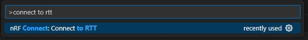
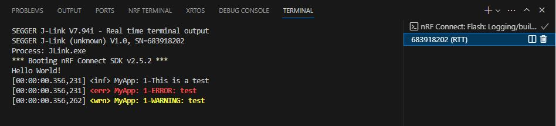

SDK version: NCS v2.5.2  -  Link to Hands-on solution: https://github.com/ChrisKurz/nRF_Connect_SDK/tree/main/Workspace/NCSv2.5.2/Logging

# Zephyr Logging

## Introduction

Zephyr consists of very many software modules, which can be added individually to the own project. The adding is done with the help of CONFIG settings. 
So you can use config - or let's call it kconfig - to add the different Zephyr software modules into your own project. 

In this chapter we will look at the Zephyr Logging library. The implemented logging solution is very extensive. So here we will only look at the very basic functionality. 

In previous chapter we have already seen a simple way to send a message via UART; we used the __printk__ instruction. This is a simple method, but Zephyr Logging offers more functionality. Logging is very common in the Zephyr project. It is used in its software modules and it can individually be enabled. These debug messages can consist of text strings or data, for example debug messages, measurement results or content of varialbes. 

The Zephyr Logging allows debugging during runtime, which is very useful for runtime critical applications like RTOS or debugging Bluetooth connections.
And it can also be used for your own application. We will have a closer look at this in the next example project.

## Required Hardware/Software
- Development kit [nRF52840DK](https://www.nordicsemi.com/Products/Development-hardware/nRF52840-DK), [nRF52833DK](https://www.nordicsemi.com/Products/Development-hardware/nRF52833-DK), or [nRF52DK](https://www.nordicsemi.com/Products/Development-hardware/nrf52-dk), (nRF54L15DK)
- Micro USB Cable (Note that the cable is not included in the previous mentioned development kits.)
- install the _nRF Connect SDK_ v2.5.2 and _Visual Studio Code_. The installation process is described [here](https://academy.nordicsemi.com/courses/nrf-connect-sdk-fundamentals/lessons/lesson-1-nrf-connect-sdk-introduction/topic/exercise-1-1/).

## Hands-on step-by-step description 

### Create a new Project

1) Make a copy of the [Creating a Project from Scratch](https://github.com/ChrisKurz/nRF_Connect_SDK/tree/main/Workspace/NCSv2.5.2/hello_world) hands-on and store it in your workspace folder, e.g.  C:/Nordic/Workspace/Logging 

2) Start Visual Studio Code and open the __Logging__ project.

### Include and register Zephyr Logging

3) Add __Zephyr Logging__ Software Module to your project by adding following lines in __prj.conf__ file. 

   _prj.conf_ 
   
       # Enable Logging
       CONFIG_LOG=y

   __NOTE: When setting a CONFIG value ensure that there are no spaces around the equal sign!__

4) We need to include the logging header file to get access in C code to the logging functionality. This is done by adding following line in main.c:

   _src/main.c_ 
   
       #include <zephyr/logging/log.h>
       
5) Before we can use the logging instructions, we have to register the logging for this new software module (the new software module is our own application). This is done by adding following lines before the main function:

   _src/main.c_ 
   
       /** LOG MODULE REGISTRATION:
           - First parameter: module name
           - Second Parameter (optional): log level
                Following Log-Levels can be used:
                    LOG_LEVEL_NONE  => OFF:     log will not be active. 
                    LOG_LEVEL_ERR   => ERROR:   write only LOG_ERR messages
                    LOG_LEVEL_WRN   => WARNING: write LOG_WRN and LOG_ERR messages
                    LOG_LEVEL_INF   => INFO:    write LOG_INF, LOG_WRN, and LOG_ERR messages
                    LOG_LEVEL_DBG   => DEBUG:   write LOG_DBF, LOG_INF, LOG_WRN, and LOG_ERR messages
       **/
       LOG_MODULE_REGISTER(MyApp,LOG_LEVEL_WRN);

### Adding Logging example messages

6) Now we are ready to create debug outputs in our own application. For test purposes we add the following lines in main function:

   _src/main.c_ => add in main() function 

            LOG_INF("1-This is a test");
            LOG_ERR("1-ERROR: test");
            LOG_WRN("1-WARNING: test");
            LOG_DBG("1-DEBUG: test");
       
## Testing

7) Build the project, download the code to a development kit, and check the output via the virtual COM port (Settings: 115200 baud, 8 data bits, 1 stop bit, no partiy, no flow control). Easiest way is to use the _Serial Terminal_ in the _nRF Connect for Desktop_ tool.

   

   __Note: We have set the Log Level to "LOG_LEVEL_WRN". Because of this the output only shows the _warnings_ and _errors_.__

8) Change the log level in the LOG_MODULE_REGISTER instruction and check the debug messages seen on your computer terminal.  

   

   ___Note: In above screen shot the Log Level was set to "LOG_LEVEL_INF".__ 

### Using RTT backend for Logging

The debug messages can be sent via different interfaces or also called backends. Zephyr allows to select UART or RTT. By default both backends are enabled. Let's try to use the RTT backend. 

9) Open _Command Palette_ (Ctrl+Shift+P) and enter "connect to rtt". The _Command Palette_ then searches for these words and suggests various existing commands, in our case "nRF Connect: Connect to RTT". By clicking on this line, we execute this command. 

   

10) Then you will be asked to "Select a device". Here you should get a list of detected Boards - note that the serial number of the development kit is listed here. Click on the one you would like to use.

11) For the setting "Choose memory address strategy" we use "Search for RTT memory address automatically".
  
12) In _Visual Studio Codes_'s Terminal window you should now see the logging output. 

   

   __Note: You are seeing logging messages in RTT and Serial Terminal, because the default setting in your project enables UART and RTT backend.__
   
13) Let's change this default setting. The Logging backends can be changed via KCONFIG settings. Easiest way is to use either _nRF KCONFIG GUI_ or _GUICONFIG_. Search for the "Logging" config (e.g. in GUICONFIG click on "Jumpt to..."). Or open directly the folder __Sub Systems and OS Services / Logging / Backends__. Enable/disable the "UART backend" or "Segger J-Link RTT backend". After changing the settings press "Save" button. Note that the "Configuration saved to ..." message in the status bar. The settings are stored in the build directory. Take care, because doing a "Pristine build" will erase this folder before it is build again. So this means you should only use the "Build" in the ACTIONS tab, and not "pristine Build". 

14) Flash the updated project and check the output in the _Serial Terminal_ and RTT terminal.
