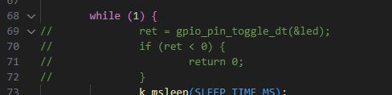
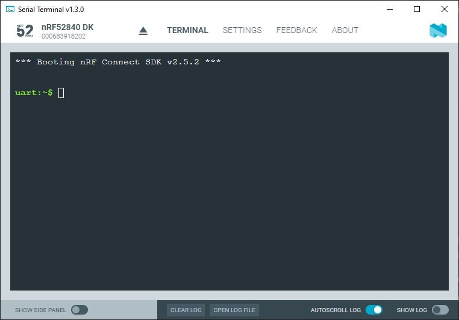
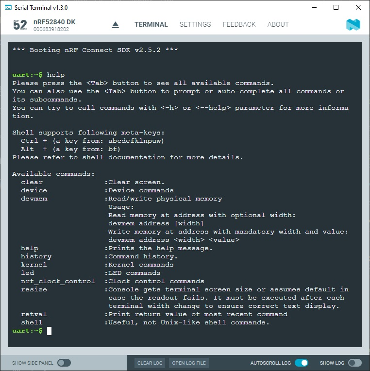
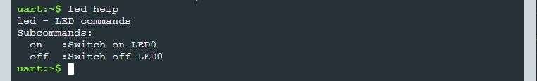
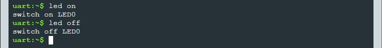

SDK version: NCS v2.5.2  -  Link to Hands-on solution: https://github.com/ChrisKurz/nRF_Connect_SDK/tree/main/Workspace/NCSv2.5.2/shell

# Zephyr OS Service: Shell

## Introduction

This module allows you to create and handle a shell with a user-defined command set. You can use it in examples where more than simple button or LED user interaction is required. This module is a Unix-like shell with a lot of [features](https://docs.nordicsemi.com/bundle/ncs-latest/page/zephyr/services/shell/index.html#overview). 

It is particularly interesting that Zephyr has a predefined shell solution for various software drivers. So you can test the software modules [Bluetooth](https://docs.nordicsemi.com/bundle/ncs-latest/page/nrf/samples/bluetooth/shell_bt_nus/README.html), [Sensor driver](https://docs.nordicsemi.com/bundle/ncs-latest/page/zephyr/samples/sensor/sensor_shell/README.html), [Flash driver](https://docs.nordicsemi.com/bundle/ncs-latest/page/zephyr/samples/drivers/flash_shell/README.html), [Wifi](https://docs.nordicsemi.com/bundle/ncs-latest/page/zephyr/samples/net/wifi/README.html), and many more using shell examples and reuse the corresponding code that is used in the shell commands. 

## Required Hardware/Software
- Development kit [nRF52840DK](https://www.nordicsemi.com/Products/Development-hardware/nRF52840-DK), [nRF52833DK](https://www.nordicsemi.com/Products/Development-hardware/nRF52833-DK), or [nRF52DK](https://www.nordicsemi.com/Products/Development-hardware/nrf52-dk), (nRF54L15DK)
- Micro USB Cable (Note that the cable is not included in the previous mentioned development kits.)
- install the _nRF Connect SDK_ v2.5.2 and _Visual Studio Code_. The installation process is described [here](https://academy.nordicsemi.com/courses/nrf-connect-sdk-fundamentals/lessons/lesson-1-nrf-connect-sdk-introduction/topic/exercise-1-1/).

## Hands-on step-by-step description 

### Create a new Project

1) Create a new project based on blinky (/zephyr/samples/basic/blinky)

### Add needed Software Modules

2) Now we add the Zephyr Shell software module to our project. Add following lines in _prj.conf_ file:

	_prj.conf_

       # Enable Zephyr Shell
       CONFIG_SHELL=y

3) We have to include the Zephyr Shell header file in _main.c_ file:

	_src/main.c_

       #include <zephyr/shell/shell.h>

### Define new Shell Commands

4) We want to implement a command ("led") that allows us to switch an LED on ("on") or off ("off") using a parameter. First, we do the definition of this level 0 command ("led") and level 1 commands ("on" and "off) by adding following lines to __main.c__ file:

	_src/main.c_

       /* Creating subcommands (level 1 command) array for command "led". */
       SHELL_STATIC_SUBCMD_SET_CREATE(sub_led,
               SHELL_CMD(on, NULL, "Switch on LED0", cmd_led_on),
               SHELL_CMD(off, NULL, "Switch off LED0", cmd_led_off),
               SHELL_SUBCMD_SET_END
       );
       /* Creating root (level 0) command "led" */
       SHELL_CMD_REGISTER(led, &sub_led, "LED commands", NULL);

   __NOTE:__ If the corresponding shell commands are now entered, a predefined function should be executed. The _cmd_led_on()_ function is called for the __led on__ command. And for the __led off__ command, the _cmd_led_off()_ function should be called. 

6) Let's add the two function _cmd_led_on()_ and _cmd_led_off()_:

	_src/main.c_

       static int cmd_led_on(const struct shell *shell, size_t argc, char **argv)
       {
          ARG_UNUSED(argc);   
          ARG_UNUSED(argv);

          printk("switch on LED0\n");
          gpio_pin_set_dt(&led,1);
          return 0;
       }

       static int cmd_led_off(const struct shell *shell, size_t argc, char **argv)
       {
           ARG_UNUSED(argc);   
           ARG_UNUSED(argv);

           printk("switch off LED0\n");
           gpio_pin_set_dt(&led,0);
           return 0;
       }

### Clean up the Code

6) __Remove__ these lines from the original blinky example:

   

## Testing

7) Build the project and download to an nRF52 development kit (e.g. nRF52840-DK).

8) Ensure the code is executed on your development kit. This can be done by connecting the development kit via USB to your computer and opening a terminal program (e.g. Putty, TeraTerm, or Nordic's _Serial Terminal_). Terminal program settings:  115200 baud, 8 data bits, 1 stop bit, no parity, no flow control

   You should see following output in the terminal:
   
   

9) Enter the command "help". You should see a list of supported shell commands. 

   

   __Note:__ In the list of available commands, you can also see the __led__ command that we have defined.

11) When we defined the commands in step 4, we also add some information that is output when a help command is entered. To see these information enter __led help__ in the terminal: 

   

11) Switch on/off the LED by entering the commands __led on__ or __led off__.

   
   
