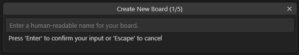

SDK version: NCS v2.5.2  -  Link to Hands-on solution: https://github.com/ChrisKurz/nRF_Connect_SDK/tree/main/Workspace/NCSv2.5.2/board_1

# Creating a Custom Board Definition from Scratch

## Introduction

There are hundreds of predefined boards available in the Zephyr project, and therefore also in nRF Connect SDK. 

In general, it is possible to set up your own projects that use your own PCBs on the basis of the predefined boards. In this case, the settings of the development kit boards are overwritten via an overlay file. 

Another possibility is to set up your own board in your own definition. This avoids the overhead that would be caused by the development kit board and the own board definition would be clearer and easier to read. 

In this hands-on, we define a very simple board that essentially consists of just one connected LED. This file could then of course be extended with further definitions.

## Required Hardware/Software
- Development kit [nRF52840DK](https://www.nordicsemi.com/Products/Development-hardware/nRF52840-DK), [nRF52833DK](https://www.nordicsemi.com/Products/Development-hardware/nRF52833-DK), or [nRF52DK](https://www.nordicsemi.com/Products/Development-hardware/nrf52-dk), (nRF54L15DK)
- Micro USB Cable (Note that the cable is not included in the previous mentioned development kits.)
- install the _nRF Connect SDK_ v2.5.2 and _Visual Studio Code_. The installation process is described [here](https://academy.nordicsemi.com/courses/nrf-connect-sdk-fundamentals/lessons/lesson-1-nrf-connect-sdk-introduction/topic/exercise-1-1/).

## Hands-on step-by-step description 

### Create the own Board Definition

1) In general, the SDK directory should not be changed during project development. It should be known that the predefined boards can be found in the directories _SDK directory_/zephyr/boards and _SDK directory_/nrf/boards. When we define our own board, it should be saved outside the SDK directory, for example in the directory __C:/Nordic/MyBoards__.

   Create the new directory __C:/Nordic/MyBoards__. 
2) The _nRF Connect_ extension within _Visual Studio Code_ also offers a Board Wizard that helps with defining new Boards. Let's use this wizard.

   Click on __Create a new board__.

      
   
4)  Within Visual Studio Code you will see that the __Create New Board__ Wizards will guide you through 5 steps:
    - "Enter a human-readable name for your board." - Enter here for example __My Test Board__.

      

      > **_Note:_**
      > 
      > When naming your custom board, there are a few conventions that you should follow:
      > - You must give your board a unique name. Run __west boards__ in the nRF Connect Terminal to get a list of names already assigned; you cannot name your custom board with a name that is already in use.
      > - It is recommended that the name of your board also contains the name of the SoC. For example, let's say we want to create a new board called __MyBoard__ based on the nRF52833 SoC. Then it is recommended to name your board "__MyBoard nRF52833__".

    - Then a __board ID__ is needed. The wizard automatically generates an ID based on the previous entry. Nevertheless, you could also define a own ID. Let's use the automatically generated board ID.

      
    - In the next step we select the SoC which is used on our board. Here it is important to select the exact SoC number (nRF52840, nRF52832, ...) as well as its variant (QIAA, CIAA, ...).

      
    - Now input the path in which the new board should be created. Here we select the directory we created in step 1: __C:/Nordic/MyBoards__.

      
    - "Enter the name of the company that made this board." - The DeviceTree requires for its _compatible_ property a vendor name (or company name). The name we enter will be used. So use your own company name here. 

      
5) If the previous board wizard steps have been done, then the following files should be present in our __C:/Nordic/MyBoards__ directory.

   

### Make custom board directory accessible for build system

5) If we want to use our own board for a project, we must first tell the build system in which other directories to search for boards. In addition, Visual Studio Code should also know where to find the custom boards, which also makes these boards selectable when you __Add build configuration__. So we set the path to our custom boards in the Visual Studio Code settings. Navigate to __File|Preferences|Settings|Extensions|nRF Connect >> Board Roots__, then add the directory defined in step 1 and press "Ok" button. 

   
   

### Create a new project
6) Create a new project based on Zephyr's blinky (/zephyr/samples/basic/blinky). And when creating the _build configuration_, select the board that we previously created with the board wizard.

   

   > **_Note:_** You should see that there is an additional filter "Custom boards". If you activate this filter, only a list of custom boards should be displayed in the drop-down list. In our case, we have only defined one board, so you should only see this one.
   > 
   >  

### Add the custom board specific settings in the board defintion
At this point, the board definition already exists. You can already select the board for a project. However, it currently only consists of the basic structure. The next steps are to add the specific settings for your own board now. As an example, the definition of the LED connected to a GPIO will be made here. 

Usually, however, much more points should be considered here. Such as:
- How should the power supply in the nRF5 chip be configured? (LDO, DC/DC)
- Should Logging be activated? (if yes, via UART or/and RTT)

The defined development kit boards in Zephyr and nrf folder of the SDK may help here to find appropriate settings.

#### KCONFIG file ("my_test_board_defconfig")
7) KCONFIG settings are defined in this file specifically for the custom board. In our example, we only want to use the LED. Therefore we have to include the Zephyr software module for the use of GPIOs. 
   
   Add following lines in the __my_test_board_defconfig__ file.

    __c:/Nordic/MyBoards/boards/arm/my_test_board/my_test_board_defconfig__

       # Enable GPIO
       CONFIG_GPIO=y

#### DeviceTree file ("my_test_board.dts")

8) Let's enable the GPIO that is used for the LED. So in the DeviceTree Source file (DTS file) we add following lines:

   __c:/Nordic/MyBoards/boards/arm/my_test_board/my_test_board.dts__

       &gpio0 {
            status = "okay";
       };
 
       &gpiote {
            status = "okay";
       };   
   
10) Using DeviceTree in our C source code requires two defines:
    - a node that allows to access the properties
    - and the properties itself

   The default blinky sample is using ALIAS to access the node. I don't want to change the blinky source code, so we will also define an ALIAS for the LED0 in the DeviceTree file.

   __c:/Nordic/MyBoards/boards/arm/my_test_board/my_test_board.dts__

       / {
           leds {
               compatible = "gpio-leds";
               
               led0: led_0 {
                   gpios = <&gpio0 13 GPIO_ACTIVE_LOW>;
                   label = "LED0 (green)";
               };
           };

           aliases {
               led0 = &led0;
           };
       };

> **_Note:_** The property __gpios = <&gpio0 13 GPIO_ACTIVE_LOW>;__ specifies that pin P0.13 is used for LED0. Please check where the LED is connected on your board and change the setting of the port or pin number if necessary.

## Testing

11) Build the project and flash it to the development kit. You should see the LED blinking.

12) The blinky project also enables GPIO in its __prj.conf__ file. Remove the __CONFIG_GPIO=y__ line in the project's __prj.conf__ file. Build and flash the project again. LED should still blink, because the GPIO software module is added in the custom board definition.

