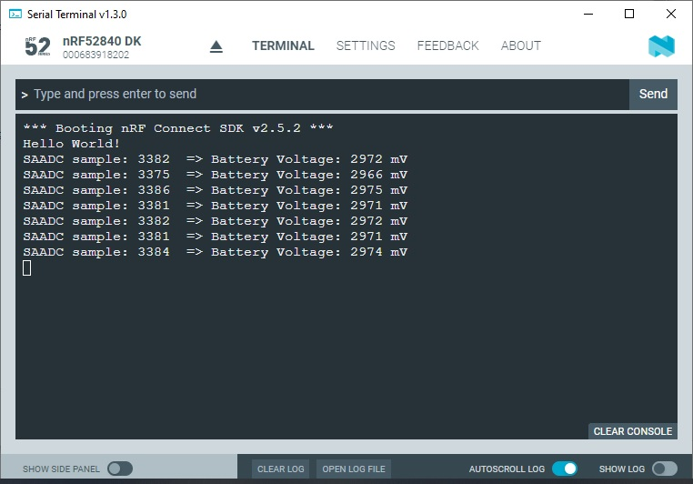

SDK version: NCS v2.5.2  -  Link to Hands-on solution: https://github.com/ChrisKurz/nRF_Connect_SDK/tree/main/Workspace/NCSv2.5.2/NRFX_ADC_1

# NRFX Driver: ADC - Using a single ADC channel

## Introduction

This exercise demonstrates the use of Nordic's NRFX ADC driver. This driver allows you to use the extended ADC features available in the SAADC peripheral module.

## Required Hardware/Software
- Development kit [nRF52840DK](https://www.nordicsemi.com/Products/Development-hardware/nRF52840-DK), [nRF52833DK](https://www.nordicsemi.com/Products/Development-hardware/nRF52833-DK), or [nRF52DK](https://www.nordicsemi.com/Products/Development-hardware/nrf52-dk), (nRF54L15DK)
- Micro USB Cable (Note that the cable is not included in the previous mentioned development kits.)
- install the _nRF Connect SDK_ v2.5.2 and _Visual Studio Code_. The installation process is described [here](https://academy.nordicsemi.com/courses/nrf-connect-sdk-fundamentals/lessons/lesson-1-nrf-connect-sdk-introduction/topic/exercise-1-1/).

## Hands-on step-by-step description 
In this hands-on exercise, we will use the simple mode of the NRFX SAADC driver to measure the battery voltage applied to the chip supply pin VDD.

### Create a new Project
1) Create a new project based on [Creating a Project from Scracth_ exercise](https://github.com/ChrisKurz/nRF_Connect_SDK/blob/main/doc/NCSv2.5.2_01_ProjectFromScratch.md).

### Add the NRFX Software Library
2) Add the NRFX SAADC driver to the project. 

	_prj.conf_

       CONFIG_NRFX_SAADC=y

3) In order to use the ADC hardware driver API we also need to add the corresponding header file to our _main.c_ file:

	_src/main.c_

       #include <nrfx_saadc.h>

### Adding DeviceTree overlay file for enabling ADC
4) Create an overlay file. (e.g. __nrf52840DK_nrf52840.overlay__)

5) Enable the ADC by adding following lines.

	_nrf52840DK_nrf52840.overlay_

       &adc {
           status = "okay";
       };

> **_Note:_** By default, the ADC is enabled in the board's DTS file for all development kits. However, you may need to enable it for custom boards. The DTS lines shown here is only required for custom boards!
 

### ADC initialization
4) Declare a structure to hold the configuration for the SAADC channel used to sample the battery voltage. The macro will assign default configuration parameters for a single-ended input. The configuration can be changed later. Add this line close to the top of __main.c__ file:

	_src/main.c_

       static nrfx_saadc_channel_t channel = NRFX_SAADC_DEFAULT_CHANNEL_SE(NRF_SAADC_INPUT_AIN1, 0);

5) The Zephyr RTOS requires to "connect" interrupt. This means that the RTOS is aware of the interrupts and handles them.

	_src/main.c_ => main() function

           IRQ_CONNECT(DT_IRQN(DT_NODELABEL(adc)),
                      DT_IRQ(DT_NODELABEL(adc), priority),
                      nrfx_isr, nrfx_saadc_irq_handler, 0);

6) Let's initialize the SAADC driver.

	_src/main.c_ => main() function

           nrfx_err_t err = nrfx_saadc_init(DT_IRQ(DT_NODELABEL(adc), priority));
           if (err != NRFX_SUCCESS) {
               printk("nrfx_saadc_init() error: %08x\n", err);
               return 0;
           }

7) Now configure the SAADC channel.

	_src/main.c_ => main() function

           channel.channel_config.gain = NRF_SAADC_GAIN1_6;
           err = nrfx_saadc_channels_config(&channel, 1);
           if (err != NRFX_SUCCESS) {
               printk("nrfx_saadc_channels_config() error: %08x\n", err);
               return 0;
           }

8) Configure the nrfx_SAADC dirver in simple mode on channel 0. Passing NULL to the last argument causes the driver to operate in blocking mode.

	_src/main.c_ => main() function

           err = nrfx_saadc_simple_mode_set(BIT(0),
                                            NRF_SAADC_RESOLUTION_12BIT,
                                            NRF_SAADC_OVERSAMPLE_DISABLED,
                                            NULL);
           if (err != NRFX_SUCCESS) {
               printk("nrfx_saadc_simple_mode_set8() error: %08x\n", err);
               return 0;
           }

9) Define the buffer in which the conversion sample is to be saved. As the sampling interval is quite long and we are only sampling one channel, a buffer of one word is sufficient.

	_src/main.c_ => main() function

           err = nrfx_saadc_buffer_set(&sample, 1);
           if (err != NRFX_SUCCESS) {
               printk("nrfx_saadc_buffer_set() error: %08x\n", err);
               return 0;
           }

### ADC conversions

10) Declare the buffer in which the conversion sample value is to be stored.

	_src/main.c_ => main() function

        static nrf_saadc_value_t sample;

11) Let's add a __while(1)__ loop in the main function. Here we will trigger to start a new A/D conversion and afterwards calculate the battery voltage.

	_src/main.c_ => main() function

            while(1){
                nrfx_err_t err = nrfx_saadc_mode_trigger();
                if (err != NRFX_SUCCESS) {
                    printk("nrfx_saadc_mode_trigger error: %08x", err);
                    return 0;
                }
                int battery_voltage = ((600*6) * sample) / ((1<<12));
                printk("SAADC sample: %d", sample);
                printk("  => Battery Voltage: %d mV\n", battery_voltage);
                k_sleep(K_MSEC(2000));
            }

## Testing

12) Build and flash the application to your development kit.

13) Apply a test signal (e.b. battery voltage) to the ADC input.

14) Check the output on the Serial Terminal.

   
