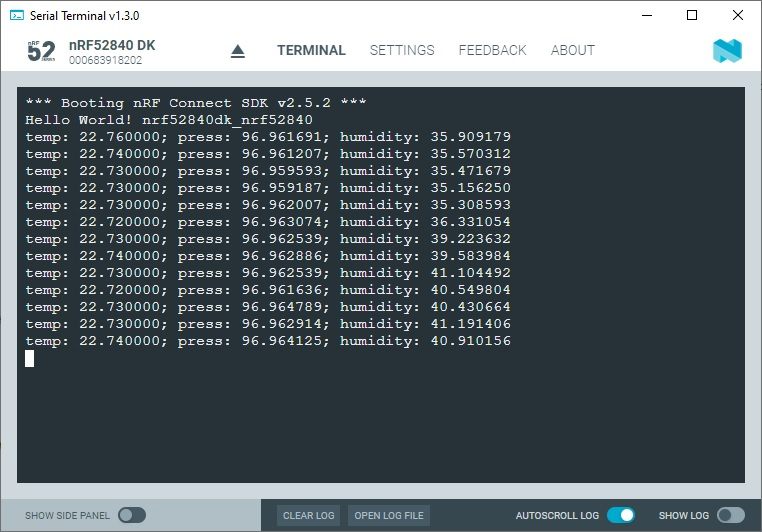

SDK version: NCS v2.5.2; Board: nRF52840DK; Directory with Solution: https://github.com/ChrisKurz/nRF_Connect_SDK/tree/main/Workspace/NCSv2.5.2/ZDD_BME280_main

# Zephyr Device Driver: Adding BME280 Sensor Driver to an nRF52480 Project

There are a large of drivers in the Zephyr RTOS. In this hands-on exercise, we will take a closer look at the Sensor Drivers, specifically the BME280 sensor driver.

## Required Hardware and Software
- [nRF52840DK development kit](https://www.nordicsemi.com/Products/Development-hardware/nRF52840-DK)
- BME280 board (e.g. from [DigiKey](https://www.digikey.de/de/products/detail/pimoroni-ltd/PIM472/10329004?utm_adgroup=&utm_source=google&utm_medium=cpc&utm_campaign=PMax:%20Smart%20Shopping_Product_Zombie%20SKUs&utm_term=&productid=10329004&utm_content=&utm_id=go_cmp-18521752285_adg-_ad-__dev-c_ext-_prd-10329004_sig-CjwKCAiA1MCrBhAoEiwAC2d64UWWHbkjNYi9l8UAy99278xOGrYvVKB7msImOtXb-atsvhYavEF5iRoCC3MQAvD_BwE&gad_source=4&gclid=CjwKCAiA1MCrBhAoEiwAC2d64UWWHbkjNYi9l8UAy99278xOGrYvVKB7msImOtXb-atsvhYavEF5iRoCC3MQAvD_BwE) or [Mouser](https://www.mouser.de/ProductDetail/Pimoroni/PIM472?qs=P1JMDcb91o7p2TYl00AP7g%3D%3D&mgh=1&vip=1&gad_source=1&gclid=CjwKCAiA1MCrBhAoEiwAC2d64cqZCSacTMr-zg7ERu2WAsZ_KyYkPN1RFyjCxMJVKIW8GwCHrWX-vxoCImUQAvD_BwE))
- Cable (e.g. from [DigiKey](https://www.digikey.de/de/products/detail/sparkfun-electronics/PRT-09140/5993845) or [Mouser](https://www.mouser.de/ProductDetail/SparkFun/PRT-09140?qs=WyAARYrbSnadDqOX3IDrug%3D%3D))
- install the _nRF Connect SDK_ v2.5.2 and _Visual Studio Code_. The installation process is described [here](https://academy.nordicsemi.com/courses/nrf-connect-sdk-fundamentals/lessons/lesson-1-nrf-connect-sdk-introduction/topic/exercise-1-1/).

## Hands-on step-by-step description 

### Connecting the BME280 Breakout Board to the nRF52840DK

1) First connect the BME280 breakout board to the nRF52840DK as shown in the picture:

    

### Create your own Project based on _hello_world_ Example

2) Create a new project based on Zephyr's _hello_world_ example (zephyr/samples/hello_world).

3) The Zephyr _hello_world_ example does not include the __zephyr/kernel.h__ header file. We include this header file in the main.c file:

   _src/main.c_ 

       #include <zephyr/kernel.h>

### Definition of Hardware Usage in DeviceTree Files

4) Let us now configure the BME280 sensor driver in an DeviceTree Overlay file. The Overlay file allows us to overwrite definitions made in the pre-defined board file __nRF52840DK_nRF52840.dts__. We will use the I2C definition of the Arduino Shield and modify it as described in the following text. 
 
    Create the file __nRF52840DK_nRF52840.overlay__ in your project folder. (IMPORTANT: Make sure you use exactly this name, as we will overwrite the file __nRF52840DK_nRF52840.dts__ with this name!)

    Then add following content to this file:

    _nRF52840DK_nRF52840.overlay_
    
       /* Configuration of a BME280 device on an Arduino I2C bus.
          -------------------------------------------------------
          Device Address 0x76 is used here. 
          Selected pins (Arduino I2C bus default pins - I2C0):
               SCL  ->  P0.27
               SDA  ->  P0.26
       */    
       &arduino_i2c {
               status = "okay";
               bme280@76 {
                       compatible = "bosch,bme280";
                       reg = <0x76>;
               };
       };

   __Note:__ You must perform an __pristine build__ after you have created the *.overlay file in Visual Studio Code. 

### Using the DeviceTree Definitions in our C-Code
In the previous step, we defined the hardware usage for the BME280 sensor. Now we need to use these definitions in our C code. This is done in the following steps:

5) Get the device structure from the DeviceTree node with the compatible "bosch,bme280". This is done by adding following line in main function:

    _src/main.c_ - add following lines in __void main(void)__ function 
    
           const struct device *dev = DEVICE_DT_GET_ANY(bosch_bme280);
           if (dev==NULL){
               /* No such node, or the node does not have status "okay". */
               printk("\nError: Device \"%s\" is not ready.\n", dev->name);
               return 0;
           }

6) We use the __DEVICE_DT_GET_ANY__ macro here. This is a DeviceTree macro and is defined in the header file __device.h__. We must therefore include this header file in our project. Add the following line to the __main.c__ file

    _src/main.c_ 
    
       #include <zephyr/device.h>

### KCONFIG: Adding the BME280 Sensor Driver to our Project

7) The required software modules can be added to our project by setting the corresponding CONFIG symbols (KCONFIG). Let's consider which software modules are needed:
    > - I2C: The BME280 itself supports I2C and SPI interfaces. However, the breakout board is designed so that only I2C is used. 
    > - Sensor: Include the sensor drivers to get access to the BME280 sensor driver. 

   To enable these modules, we need to add following lines to the __prj.conf__ file.
    
   _prj.conf_
    
       # Enable Software Modules for BME280 Sensor Driver Usage
       CONFIG_I2C=y
       CONFIG_SENSOR=y
    
### Using the BME280 Sensor Driver in our own Application
We have included the driver with the previous steps. Now we will use the driver in our own Application software. 

8) We keep our software quite simple and handle the sensor measurements in the main entire loop. So insert following lines into the main function:

    _src/main.c_ - add following lines in __void main(void)__ function 
    
           while(1){
               struct sensor_value temp, press, humidity;
            
               sensor_sample_fetch(dev);
               sensor_channel_get(dev, SENSOR_CHAN_AMBIENT_TEMP, &temp);
               sensor_channel_get(dev, SENSOR_CHAN_PRESS, &press);
               sensor_channel_get(dev, SENSOR_CHAN_HUMIDITY, &humidity);
                
               printk("temp: %d.%06d; press: %d.%06d; humidity: %d.%06d\n",
                       temp.val1, temp.val2, press.val1, press.val2,
                       humidity.val1, humidity.val2);

               k_sleep(K_MSEC(1000));                
           }

9) We use the functions __sensor_sample_fetch__ and __sensor_channel_get__ to trigger a measurement and read the conversion results. The use of these functions requires their declaration. This is done in the header file __sensor.h__. We must therefore include them in our project. Insert following line at the beginning of the main.c file:

    _src/main.c_ 
    
       #include <zephyr/drivers/sensor.h>

## Testing

### Build the Project and Download to the Development Kit

10) Click on the "Build" button in the ACTIONS menu. 

11) Make sure that the connected kit has been found and click on __Flash__ in the ACTIONS menu. The code will now be downloaded to the kit. 

### Open Terminal and check Output

12) Open the terminal. We recommend using the _Serial Terminal_ from Nordic, which can be found in the _Connect for Desktop_ application. With this terminal, the default setting can be used and the received data should be output immediately after a connection. 

       In case another terminal program is used, here are the necessary settings: 

       - Baud Rate: 115200 
       - Data bits: 8
       - Stop bits: 1
       - Parity:    none
       - Flow control: off
    
13) Reset the kit by pressing the Reset button on the board. The Zephyr boot message is displayed in the terminal, followed by an optional application startup output and the measurement results. 

    
