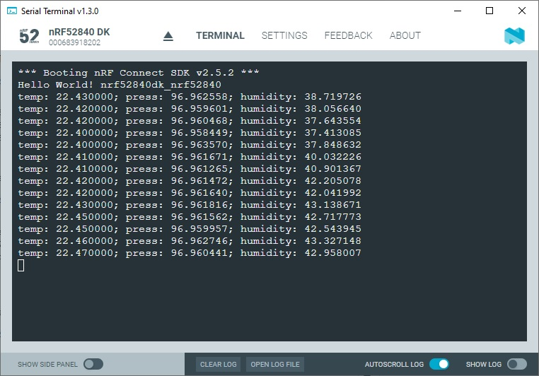

SDK version: NCS v2.5.2  -  Link to Hands-on solution: https://github.com/ChrisKurz/nRF_Connect_SDK/tree/main/Workspace/NCSv2.5.2/ZDD_BME280_Thread

# Zephyr Device Driver: Moving BME280 Sensor Driver handling to a Thread

## Introduction

In previous hands-on we added the sensor handling in the main loop. Let's change the previous project so that the handling is done in a Thread. 

## Required Hardware and Software
- [nRF52840DK development kit](https://www.nordicsemi.com/Products/Development-hardware/nRF52840-DK)
- BME280 board (e.g. from [DigiKey](https://www.digikey.de/de/products/detail/pimoroni-ltd/PIM472/10329004?utm_adgroup=&utm_source=google&utm_medium=cpc&utm_campaign=PMax:%20Smart%20Shopping_Product_Zombie%20SKUs&utm_term=&productid=10329004&utm_content=&utm_id=go_cmp-18521752285_adg-_ad-__dev-c_ext-_prd-10329004_sig-CjwKCAiA1MCrBhAoEiwAC2d64UWWHbkjNYi9l8UAy99278xOGrYvVKB7msImOtXb-atsvhYavEF5iRoCC3MQAvD_BwE&gad_source=4&gclid=CjwKCAiA1MCrBhAoEiwAC2d64UWWHbkjNYi9l8UAy99278xOGrYvVKB7msImOtXb-atsvhYavEF5iRoCC3MQAvD_BwE) or [Mouser](https://www.mouser.de/ProductDetail/Pimoroni/PIM472?qs=P1JMDcb91o7p2TYl00AP7g%3D%3D&mgh=1&vip=1&gad_source=1&gclid=CjwKCAiA1MCrBhAoEiwAC2d64cqZCSacTMr-zg7ERu2WAsZ_KyYkPN1RFyjCxMJVKIW8GwCHrWX-vxoCImUQAvD_BwE))
- Cable (e.g. from [DigiKey](https://www.digikey.de/de/products/detail/sparkfun-electronics/PRT-09140/5993845) or [Mouser](https://www.mouser.de/ProductDetail/SparkFun/PRT-09140?qs=WyAARYrbSnadDqOX3IDrug%3D%3D))
- install the _nRF Connect SDK_ v2.5.2 and _Visual Studio Code_. The installation process is described [here](https://academy.nordicsemi.com/courses/nrf-connect-sdk-fundamentals/lessons/lesson-1-nrf-connect-sdk-introduction/topic/exercise-1-1/).

## Hands-on step-by-step description 

### Connecting the BME280 Breakout Board to the nRF52840DK

1) We use the same BME280 sensor board connection as in the previous hand-on. 

    

### Create a new Project based on previous Example

2) Create a new project based on the [BME280 sensor demo](https://github.com/ChrisKurz/nRF_Connect_SDK/tree/main/Workspace/NCSv2.5.2/ZDD_BME280_main). 

### KCONFIG and DeviceTree

3) No changed are needed in files __prj.conf__, __CMakeLists.txt__, and __nrf52840dk_nrf52840.overlay__.

    
### Create a new Thread for the Sensor Handling

In the previous exercise we did the sensor handling in the main function. For a real project it makes more sense to do this in a separate thread. 

4) Create a new Thread for the sensor hanlding. Insert the following lines before the main loop. 

   _src/main.c_

       K_THREAD_DEFINE(
                  my_tid,              /* Name of the thread                          */
                  MYTHREAD_STACK_SIZE, /* Stack size in bytes                       */
                  Thread_BME280,       /* Thread entry function                       */
                  NULL, NULL, NULL,    /* Passing parameters for entry point function */
                  MYTHREAD_PRIORITY,   /* Thread priority                             */
                  0,                   /* Thread options                              */
                  0);                  /* Scheduling delay (0 for no delay)           */

5) The creation of the Thread uses the parameter MYTHREAD_STACK_SIZE, which must now be defined. Insert the definition before the K_THREAD_DEFINE() macro. 

   _src/main.c_

       #define MYTHREAD_STACK_SIZE 500

6) Another parameter is MYTHREAD_PRIORTIY. We have to define it by inserting following line.

   _src/main.c_

       #define MYTHREAD_PRIORITY 5

7) The new thread calls the _Thread_BME280_ function. We now have to create this as well. Insert the following lines before the macro K_THREAD_DEFINE.

   _src/main.c_

       void Thread_BME280(void *arg1, void *arg2, void *arg3)
       {

       }

### Moving the complete BME280 sensor code from main function to the Thread

8) Now we remove the BME280 sensor handling from the _main()_ function and put it into the _Thread_BME280()_ function. These lines should be moved to Thread function:

  remove these lines from _main()_ and paste it into _Thread_BME280()_

        const struct device *dev = DEVICE_DT_GET_ANY(bosch_bme280);
        if (dev==NULL){
            /* No such node, or the node does not have status "okay". */
            printk("\nError: Device \"%s\" is not ready.\n", dev->name);
        //  return 0; // note that the Thread function does not have a return parameter. so we can remove this line.
        }

        while(1){
            struct sensor_value temp, press, humidity;
     
            sensor_sample_fetch(dev);
            sensor_channel_get(dev, SENSOR_CHAN_AMBIENT_TEMP, &temp);
            sensor_channel_get(dev, SENSOR_CHAN_PRESS, &press);
            sensor_channel_get(dev, SENSOR_CHAN_HUMIDITY, &humidity);
         
            printk("temp: %d.%06d; press: %d.%06d; humidity: %d.%06d\n",
                    temp.val1, temp.val2, press.val1, press.val2,
                    humidity.val1, humidity.val2);

            k_sleep(K_MSEC(1000));                
        }	

   __NOTE:__ The only change we have to do is to remove the "retrun 0;" line from the code we paste in _Thread_BME280()_ function!

## Testing

9) Download the project to the connect nRF52840DK board. Use a terminal program to check the debug ouptut. You should see something like this:

   
