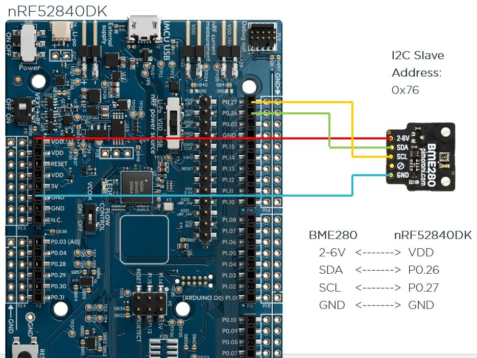
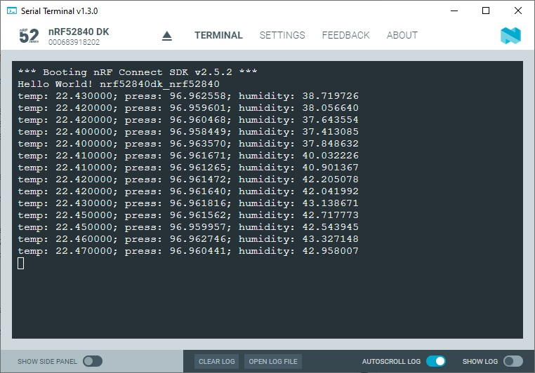

SDK version: NCS v2.5.2  -  Link to Hands-on solution: https://github.com/ChrisKurz/nRF_Connect_SDK/tree/main/Workspace/NCSv2.5.2/ZDD_BME280_Thread

# Zephyr Device Driver: Adding BME280 Sensor Driver to an nRF52840 Project as a Thread

## Introduction

There are a large number of drivers in the Zephyr RTOS. In this hands-on exercise, we will take a closer look at the Sensor Drivers, in particular the BME280 sensor driver. In the previous exercise, we used the BME280 sensor driver in the main loop. In this exercise, we will add the sensor driver to a project, but we will do the sensor handling in a separate thread.

## Required Hardware and Software
- [nRF52840DK development kit](https://www.nordicsemi.com/Products/Development-hardware/nRF52840-DK)
- BME280 board (e.g. from [DigiKey](https://www.digikey.de/de/products/detail/pimoroni-ltd/PIM472/10329004?utm_adgroup=&utm_source=google&utm_medium=cpc&utm_campaign=PMax:%20Smart%20Shopping_Product_Zombie%20SKUs&utm_term=&productid=10329004&utm_content=&utm_id=go_cmp-18521752285_adg-_ad-__dev-c_ext-_prd-10329004_sig-CjwKCAiA1MCrBhAoEiwAC2d64UWWHbkjNYi9l8UAy99278xOGrYvVKB7msImOtXb-atsvhYavEF5iRoCC3MQAvD_BwE&gad_source=4&gclid=CjwKCAiA1MCrBhAoEiwAC2d64UWWHbkjNYi9l8UAy99278xOGrYvVKB7msImOtXb-atsvhYavEF5iRoCC3MQAvD_BwE) or [Mouser](https://www.mouser.de/ProductDetail/Pimoroni/PIM472?qs=P1JMDcb91o7p2TYl00AP7g%3D%3D&mgh=1&vip=1&gad_source=1&gclid=CjwKCAiA1MCrBhAoEiwAC2d64cqZCSacTMr-zg7ERu2WAsZ_KyYkPN1RFyjCxMJVKIW8GwCHrWX-vxoCImUQAvD_BwE))
- Cable (e.g. from [DigiKey](https://www.digikey.de/de/products/detail/sparkfun-electronics/PRT-09140/5993845) or [Mouser](https://www.mouser.de/ProductDetail/SparkFun/PRT-09140?qs=WyAARYrbSnadDqOX3IDrug%3D%3D))
- install the _nRF Connect SDK_ v2.5.2 and _Visual Studio Code_. The installation process is described [here](https://academy.nordicsemi.com/courses/nrf-connect-sdk-fundamentals/lessons/lesson-1-nrf-connect-sdk-introduction/topic/exercise-1-1/).

## Hands-on step-by-step description 

### Connecting the BME280 Breakout Board to the nRF52840DK

1) First connect the BME280 Breakout Board to the nRF52840DK as shown in the next picture:

    

### Create your own Project based on _hello_world_ Example

2) Create a new project based on Zephyr's _hello_world_ example (zephyr/samples/hello_world).

3) The Zephyr _hello_world_ example does not include the __zephyr/kernel.h__ header file. We include this header file in the main.c file:

   _src/main.c_ 

       #include <zephyr/kernel.h>

### Definition of Hardware Usage in DeviceTree Files

4) Let us now configure the BME280 sensor driver in an DeviceTree Overlay file. The Overlay file allows us to overwrite definitions made in the pre-defined board file __nRF52840DK_nRF52840.dts__. We will use the I2C definition of the Arduino Shield and modify it as described in the following text. 
 
    Create the file __nRF52840DK_nRF52840.overlay__ in the folder __C:/MyWorkspace/MyProject__. (IMPORTANT: Make sure you use exactly this name, as we will overwrite the file __nRF52840DK_nRF52840.dts__ with this name!)

    Then add following content to this file:

    _nRF52840DK_nRF52840.overlay_
    
       /* Configuration of a BME280 device on an Arduino I2C bus.
          -------------------------------------------------------
          Device Address 0x76 is used here. 
          Selected pins (Arduino I2C bus default pins - I2C0):
               SCL  ->  P0.27
               SDA  ->  P0.26
       */    
       &arduino_i2c {
               status = "okay";
               bme280@76 {
                       compatible = "bosch,bme280";
                       reg = <0x76>;
               };
       };

### KCONFIG: Adding the BME280 Sensor Driver to our Project

5) The required software modules can be added to our project by setting the corresponding CONFIG symbols (KCONFIG). Let's consider which software modules are needed:
    > - I2C: The BME280 itself supports I2C and SPI interfaces. However, the breakout board is designed so that only I2C is used. 
    > - Sensor: Include the sensor drivers to get access to the BME280 sensor driver. 

   To enable these modules, we need to add following lines to the __prj.conf__ file.
    
   _prj.conf_
    
       # Enable Software Modules for BME280 Sensor Driver Usage
       CONFIG_I2C=y
       CONFIG_SENSOR=y

    
### Create a new Thread for the Sensor Handling

In the previous exercise we did the sensor handling in the main function. For a real project it makes more sense to do this in a separate thread. 

6) Create a new Thread for the sensor hanlding. Insert the following lines before the main loop. 

   _src/main.c_

       K_THREAD_DEFINE(
                  my_tid,              /* Name of the thread                          */
                  MYTHREAD_STACK_SIZE, /* Stack size in bytes                       */
                  Thread_BME280,       /* Thread entry function                       */
                  NULL, NULL, NULL,    /* Passing parameters for entry point function */
                  MYTHREAD_PRIORITY,   /* Thread priority                             */
                  0,                   /* Thread options                              */
                  0);                  /* Scheduling delay (0 for no delay)           */

7) The creation of the Thread uses the parameter MYTHREAD_STACK_SIZE, which must now be defined. Insert the definition before the K_THREAD_DEFINE() macro. 

   _src/main.c_

       #define MYTHREAD_STACK_SIZE 500

8) Another parameter is MYTHREAD_PRIORTIY. We have to define it by insterting following line.

   _src/main.c_

       #define MYTHREAD_PRIORITY 5

9) The new thread calls the _Thread_BME280_ function. We now have to create this as well. Insert the following lines before the macro K_THREAD_DEFINE.

   _src/main.c_

       void Thread_BME280(void *arg1, void *arg2, void *arg3)
       {

       }

### Using the DeviceTree Definitions in our C-Code
In the step 4, we defined the hardware usage for the BME280 sensor. We need to use these definitions in our C code. This is done in the following steps:

10) Get the device structure from the DeviceTree node with the compatible "bosch,bme280". This is done by adding following line in main function:

    _src/main.c_ - add following lines in __void Thread_BME280(...)__ function 
    
            const struct device *dev = DEVICE_DT_GET_ANY(bosch_bme280);
            if (dev==NULL){
                /* No such node, or the node does not have status "okay". */
                printk("\nError: Device \"%s\" is not ready.\n", dev->name);
                /* You can also use Zephyr Logging instead of printk() instruction, if Logging is enabled in your project. */
                // LOG_ERR("Error: Device \"%s\" is not ready.", dev->name);
                return;
            }

11) We use the __DEVICE_DT_GET_ANY__ macro here. This is a DeviceTree macro and is defined in the header file __device.h__. We must therefore include this header file in our project. Add the following line to the __main.c__ file

    _src/main.c_ 
    
        #include <zephyr/device.h>

### Using the Sensor

12)  We use the functions __sensor_sample_fetch__ and __sensor_channel_get__ to trigger a measurement and read the conversion results. The use of these functions requires their declaration. This is done in the header file __sensor.h__. We must therefore include them in our project. Insert following line at the beginning of the main.c file:

  _src/main.c_ 
    
    #include <zephyr/drivers/sensor.h>

13) The measurement results of the sensor are saved in a structure. We insert the definition at the beginning of the function _void Thread_BME280(...)_. 

    _src/main.c_ - add following lines in __void Thread_BME280(...)__ function 

            struct sensor_value temp, press, humidity;

14) First, the application instructs the driver to fetch a sample of all its channels. This is done within an entire loop, because the Sensor thread should not terminate.

    _src/main.c_ - add following lines in __void Thread_BME280(...)__ function 

            /* Initialization done. Now sensor handling can be done in following entire loop. */
            while (1){
                sensor_sample_fetch(dev);
    
            }

15) Then, individual channels may be read. These instruction should be placed after the _sensor_sample_fetch()_ function call.

    _src/main.c_ - add following lines in __void Thread_BME280(...)__ function 

                sensor_channel_get(dev, SENSOR_CHAN_AMBIENT_TEMP, &temp);
                sensor_channel_get(dev, SENSOR_CHAN_PRESS, &press);
                sensor_channel_get(dev, SENSOR_CHAN_HUMIDITY, &humidity);

16) In our project we output the measurement results in a terminal.

    _src/main.c_ - add following lines in __void Thread_BME280(...)__ function 
    
                printk("temp: %d.%06d; press: %d.%06d; humidity: %d.%06d\n",
                        temp.val1, temp.val2, press.val1, press.val2,
                        humidity.val1, humidity.val2);

17) And finally we define the measurement period. In our example, a measurement should be triggered every second. This is realized here by simply putting the thread to sleep for this time.

    _src/main.c_ - add following lines in __void Thread_BME280(...)__ function 

                k_sleep(K_MSEC(1000)); 

## Testing

18) Download the project to the connect nRF52840DK board. Use a terminal program to check the debug ouptut. You should see something like this:

   
