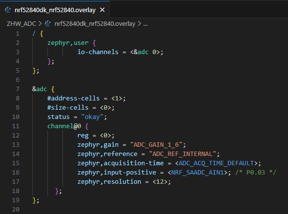

SDK version: NCS v2.5.2  -  Link to Hands-on solution: https://github.com/ChrisKurz/nRF_Connect_SDK/tree/main/Workspace/NCSv2.5.2/ZHW_ADC_1

# Zephyr Hardware Driver: ADC - Using a single ADC channel

## Introduction

This exercise demonstrates the use of the Zephyr hardware ADC driver. Note that the functionality covered by this driver is limited to basic ADC functions. If advanced ADC features from the device's peripheral module should be used, the ADC drivers from Nordic Semiconductor available in the nrfx library should be used.

## Required Hardware/Software
- Development kit [nRF52840DK](https://www.nordicsemi.com/Products/Development-hardware/nRF52840-DK), [nRF52833DK](https://www.nordicsemi.com/Products/Development-hardware/nRF52833-DK), or [nRF52DK](https://www.nordicsemi.com/Products/Development-hardware/nrf52-dk), (nRF54L15DK)
- Micro USB Cable (Note that the cable is not included in the previous mentioned development kits.)
- install the _nRF Connect SDK_ v2.5.2 and _Visual Studio Code_. The installation process is described [here](https://academy.nordicsemi.com/courses/nrf-connect-sdk-fundamentals/lessons/lesson-1-nrf-connect-sdk-introduction/topic/exercise-1-1/).

## Hands-on step-by-step description 

### Create a new Project

1) Create a new project based on [Creating a Project from Scratch_ exercise](https://github.com/ChrisKurz/nRF_Connect_SDK/blob/main/doc/NCSv2.5.2_01_ProjectFromScratch.md). 

### Add needed Software Module

2) Now we add the Zephyr ADC hardware driver to our project. Add following lines to the _prj.conf_ file:

	_prj.conf_

       # Enable Zephyr ADC Hardware driver
       CONFIG_ADC=y

3) In order to use the ADC hardware driver API we also need to add the corresponding header file to our _main.c_ file:

	_src/main.c_

       #include <zephyr/drivers/adc.h>

### Adding DeviceTree overlay file for ADC

The ADC peripheral and pinmux is configured in the DeviceTree file. Following definitions have to be added there:

- enabling of ADC by setting _status="okay";_. 
- ADC channels specified in the _io_channels_ property of the _zephyr,user_ node
- configuration of channels (settings like gain, reference, and acquisition time)
- ADC resolution
- oversampling settings (if used)

Let's prepare a DeviceTree overlay file:

4) Create an overlay file. (e.g. __nrf52840DK_nrf52840.overlay__)

5) Now add the _io_channels_ property in this file. Here we define to use one ADC peripheral (instance) and we could define a channel sequence with different configurations. However, in this first hands-on we will use only one ADC input channel. 

	_nrf52840DK_nrf52840.overlay_

       / {
              zephyr,user {
                      io-channels = <&adc 0>; 
              };
       };

       &adc {
              #address-cells = <1>;
              #size-cells = <0>;
              status = "okay";  
              channel@0 {
                      reg = <0>;
		
	            };
       };

7) Let's add the configuration for channel 0. When you have added the below lines to the DeviceTree overlay file, move the mouse pointer on the property name (e.g. "zephyr,gain"). You should see that a context window opens and help about this parameter is shown. There are also the two settings for the acquisition time and input-positive. The context window shows just a high level explanation. However, if you click on its defined values (e.g. __ADC_ACQ_TIME_DEFAULT__ or __NRF_SAADC_AIN1__) while pressing the __CTRL__, the header file is opened and the section is shown where this value is defined. Here you find further _defines_ which could also used for configuration of the properties.

   The settings we will use here is:
   - gain = 1/6:
   - reference = +0.6 V (ADC_REF_INTERNAL):
   - acquisition time = 10us (ADC_ACQ_TIME_DEFAULT):
   - input positive = P 0.03 (NRF_SAADC_AIN1): we are using here single-ended input. 
   - resolution = 12:  12-bit ADC resolution

   Add follwing lines to  __channel@0__:
   
	_nrf52840DK_nrf52840.overlay_ => add to __channel@0__ property

                      zephyr,gain = "ADC_GAIN_1_6";
                      zephyr,reference = "ADC_REF_INTERNAL";
                      zephyr,acquisition-time = <ADC_ACQ_TIME_DEFAULT>;
                      zephyr,input-positive = <NRF_SAADC_AIN1>; /* P0.03 */
                      zephyr,resolution = <12>;

So your DeviceTree overlay file should now look like this:

### Including DeviceTree Configuration in C source code

9) First, include the devicetree header file into your project.

	_src/main.c_

       #include <zephyr/devicetree.h>

10) We need a variable of type __adc_dt_spec__ for each ADC channel. We can use the __ADC_DT_SPEC_GET()__ macro to get the io-channel defintions, because we use here only one ADC input channel.

	_src/main.c_

        static const struct adc_dt_spec adc_channel = ADC_DT_SPEC_GET(DT_PATH(zephyr_user));    

11) Before we use the ADC we should check if the ADC peripheral (SAADC) is ready. 

	_src/main.c_ => main() function

            if (!adc_is_ready_dt(&adc_channel)) {
                printk("ADC controller device %s not ready\n", adc_channel.dev->name);
                return 0;
            }

12) If it is ready we setup the ADC channel.

	_src/main.c_ => main() function

            int err;

            err = adc_channel_setup_dt(&adc_channel);
            if (err < 0) {
                printk("Could not setup channel #%d (%d)\n", 0, err);
                return 0;
            }

### First, we have to do some ADC initialization

13) Define a variable of type __adc_sequence__ and a buffer of type __int16_t__ to specify where the samples are to be written.

	_src/main.c_ => main() function

            int16_t buf;
            struct adc_sequence sequence = {
                .buffer = &buf,
                /* buffer size in bytes, not number of samples */
                .buffer_size = sizeof(buf),
            };

14) Initialize the ADC sequence.

	_src/main.c_ => main() function

            err = adc_sequence_init_dt(&adc_channel, &sequence);
            if (err < 0) {
                printk("Could not initalize sequnce\n");
                return 0;
            }
 
### Then we can periodically read the ADC conversion results

15) Read the ADC conversion result.

	_src/main.c_ => main() function

            while(1){
                err = adc_read(adc_channel.dev, &sequence);
                if (err < 0) {
                    printk("Could not read (%d)\n", err);
                    continue;
                }
                val_mv = (int)buf;
                printk("ADC result: %s, channel %d: Raw: %i ", adc_channel.dev->name, adc_channel.channel_id, val_mv);

            }

17) Convert ADC conversion result to mV.

	_src/main.c_ => main() function => while(1) loop 
 
                int val_mv;

                err = adc_raw_to_millivolts_dt(&adc_channel, &val_mv);
                /* conversion to mV may not be supported, skip if not */
                if (err < 0) {
                    printk(" (value in mV not available)\n");
                } else {
                    printk(" = %d mV\n", val_mv);
                }

18) And finally we add some delay before the next ADC conversion result is read.

	_src/main.c_ => main() function => while(1) loop 
 
                k_sleep(K_MSEC(1000));

## Testing

19) Build and flash the application on your development kit.

20) Apply a test input voltage to the ADC input AIN1.

21) Check the output on the Serial Termnial, which you get from the development kit. 

   

   _This screen shot shows the measurment when VDD is connected to the ADC input pin._
