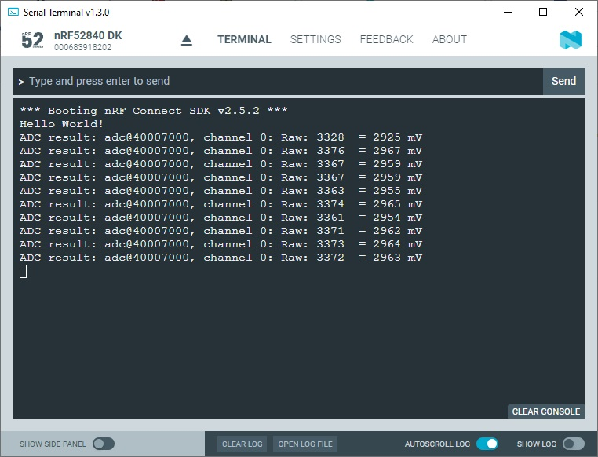

SDK version: NCS v2.5.2  -  Link to Hands-on solution: https://github.com/ChrisKurz/nRF_Connect_SDK/tree/main/Workspace/NCSv2.5.2/ZHW_ADC_1_Thread

# Zephyr Hardware Driver: ADC - Using a Thread for single channel A/D conversion

## Introduction

This exercise demonstrates the use of the Zephyr hardware ADC driver. In this sample the A/D conversion is handled in an own thread. 

## Required Hardware/Software
- Development kit [nRF52840DK](https://www.nordicsemi.com/Products/Development-hardware/nRF52840-DK), [nRF52833DK](https://www.nordicsemi.com/Products/Development-hardware/nRF52833-DK), or [nRF52DK](https://www.nordicsemi.com/Products/Development-hardware/nrf52-dk), (nRF54L15DK)
- Micro USB Cable (Note that the cable is not included in the previous mentioned development kits.)
- install the _nRF Connect SDK_ v2.5.2 and _Visual Studio Code_. The installation process is described [here](https://academy.nordicsemi.com/courses/nrf-connect-sdk-fundamentals/lessons/lesson-1-nrf-connect-sdk-introduction/topic/exercise-1-1/).

## Hands-on step-by-step description 

### Create a new Project

1) Create a copy of the previous project [Zephyr Hardware Driver: ADC - Using a single ADC channel](https://github.com/ChrisKurz/nRF_Connect_SDK/tree/main/Workspace/NCSv2.5.2/ZHW_ADC_1). 

### KCONFIG and DeviceTree

2) No changes are needed in files __prj.conf__, __CMakeLists.txt__, and __nrf52840dk_nrf52840.overlay__.

### Create a new Thread for A/D conversion handling
In the previous exercise we did the ADC handling in the main function. Here we will move the handling in a separate thread.

3) Create a new Thread for ADC handling. Inster the following lines before the main function:

    __src/main.c__

       K_THREAD_DEFINE(
           my_tid,              /* Name of the thread                          */
           MYTHREAD_STACK_SIZE, /* Stack size in bytes                       */
           Thread_ADC,          /* Thread entry function                       */
           NULL, NULL, NULL,    /* Passing parameters for entry point function */
           MYTHREAD_PRIORITY,   /* Thread priority                             */
           0,                   /* Thread options                              */
           0);                  /* Scheduling delay (0 for no delay)           */   

4) The creation of the Thread uses the parameter MYTHREAD_STACK_SIZE, which must now be defined. Insert the definition before the K_THREAD_DEFINE() macro.

    __src/main.c__

       #define MYTHREAD_STACK_SIZE  500

5) Another parameter is MYTHREAD_PRIORITY. We have to define it by inserting following line.

    __src/main.c__

       #define MYTHREAD_PRIORITY 5

6) The new Thread calls the _Thread_ADC_ function. We now have to create this as well. Insert the following lines before the macro K_THREAD_DEFINE, which we added in previous steps.

       __src/main.c__

       void Thread_ADC(void *arg1, void *arg2, void *arg3)
       {

       }

### Moving the complete ADC code from main function to the Thread

7) Now we remove the ADC code from _main()_ function and put it into the _Thread_ADC_ function. These lines should be moved to Thread function:

   remove there lines from _main()_ and paste it into _Thread_ADC_

           int err;
           int val_mv;
           int16_t buf;
    
           struct adc_sequence sequence = {
               .buffer = &buf,
               /* buffer size in bytes, not number of samples */
               .buffer_size = sizeof(buf),
           };

           if (!adc_is_ready_dt(&adc_channel)) {
               printk("ADC controller device %s not ready\n", adc_channel.dev->name);
               return;
           }

           err = adc_channel_setup_dt(&adc_channel);
           if (err < 0) {
               printk("Could not setup channel #%d (%d)\n", 0, err);
               return;
           }

           err = adc_sequence_init_dt(&adc_channel, &sequence);
           if (err < 0) {
               printk("Could not initalize sequnce\n");
               return;
           }

           while(1){
               err = adc_read(adc_channel.dev, &sequence);
               if (err < 0) {
                   printk("Could not read (%d)\n", err);
                   continue;
               }
               val_mv = (int)buf;

               printk("ADC result: %s, channel %d: Raw: %i ", adc_channel.dev->name, adc_channel.channel_id, val_mv);

               err = adc_raw_to_millivolts_dt(&adc_channel, &val_mv);
               /* conversion to mV may not be supported, skip if not */
               if (err < 0) {
                   printk(" (value in mV not available)\n");
               } else {
                   printk(" = %d mV\n", val_mv);
               }

               k_sleep(K_MSEC(1000));
           }

> **__Note:__** The __return 0;__ within the _if (err<0)_ lines have to be corrected to __return;__. 

## Testing

19) Build and flash the application on your development kit.

20) Apply a test input voltage to the ADC input AIN1.

21) Check the output on the Serial Termnial, which you get from the development kit. 

   

   _This screen shot shows the measurment when VDD is connected to the ADC input pin._
