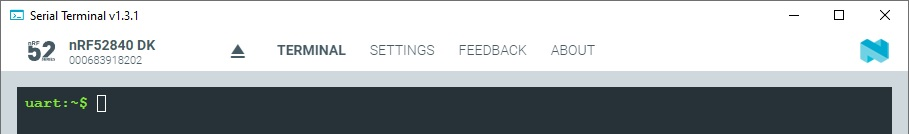
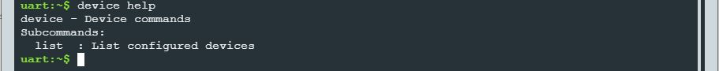
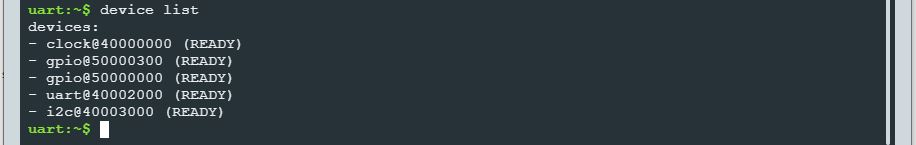
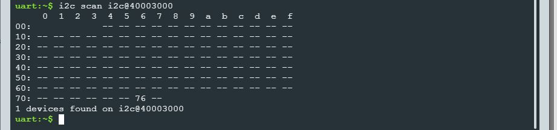

SDK version: NCS v2.6.0  -  Link to Hands-on solution: https://github.com/ChrisKurz/nRF_Connect_SDK/tree/main/Workspace/NCSv2.6.0/shell_i2c

# Zephyr OS Service: Shell - I2C Shell

## Introduction

The shell implementation in Zephyr is extremely helpful for carrying out tests with individual software modules in a simple way. Here we will take a look at the I2C shell and run a few tests with it. 

## Required Hardware/Software
- Development kit [nRF52840DK](https://www.nordicsemi.com/Products/Development-hardware/nRF52840-DK), [nRF52833DK](https://www.nordicsemi.com/Products/Development-hardware/nRF52833-DK), or [nRF52DK](https://www.nordicsemi.com/Products/Development-hardware/nrf52-dk), (nRF54L15DK)
- Micro USB Cable (Note that the cable is not included in the previous mentioned development kits.)
- BME280 board (e.g. from [DigiKey](https://www.digikey.de/de/products/detail/pimoroni-ltd/PIM472/10329004?utm_adgroup=&utm_source=google&utm_medium=cpc&utm_campaign=PMax:%20Smart%20Shopping_Product_Zombie%20SKUs&utm_term=&productid=10329004&utm_content=&utm_id=go_cmp-18521752285_adg-_ad-__dev-c_ext-_prd-10329004_sig-CjwKCAiA1MCrBhAoEiwAC2d64UWWHbkjNYi9l8UAy99278xOGrYvVKB7msImOtXb-atsvhYavEF5iRoCC3MQAvD_BwE&gad_source=4&gclid=CjwKCAiA1MCrBhAoEiwAC2d64UWWHbkjNYi9l8UAy99278xOGrYvVKB7msImOtXb-atsvhYavEF5iRoCC3MQAvD_BwE) or [Mouser](https://www.mouser.de/ProductDetail/Pimoroni/PIM472?qs=P1JMDcb91o7p2TYl00AP7g%3D%3D&mgh=1&vip=1&gad_source=1&gclid=CjwKCAiA1MCrBhAoEiwAC2d64cqZCSacTMr-zg7ERu2WAsZ_KyYkPN1RFyjCxMJVKIW8GwCHrWX-vxoCImUQAvD_BwE))
- Cable (e.g. from [DigiKey](https://www.digikey.de/de/products/detail/sparkfun-electronics/PRT-09140/5993845) or [Mouser](https://www.mouser.de/ProductDetail/SparkFun/PRT-09140?qs=WyAARYrbSnadDqOX3IDrug%3D%3D))
- install the _nRF Connect SDK_ v2.6.0 and _Visual Studio Code_. The installation process is described [here](https://academy.nordicsemi.com/courses/nrf-connect-sdk-fundamentals/lessons/lesson-1-nrf-connect-sdk-introduction/topic/exercise-1-1/).

## Hands-on step-by-step description 

### Create a new Project

1) Create a new project based on blinky (/zephyr/samples/hello_world)

### Add needed Software Modules

2) We add the Zephyr I2C Shell software module and all its dependencies to our project. Add following lines in _prj.conf_ file:

	_prj.conf_

       # Enable Zephyr Shell and I2C Shell
       CONFIG_SHELL=y
       CONFIG_I2C_SHELL=y

       # Enable GPIO and I2C
       CONFIG_GPIO=y
       CONFIG_I2C=y

### Adding DeviceTree for connected I2C Sensor

3) Create an DeviceTree overlay file in your project folder. Ensure that the board name is used, which was also used for the board selection in the build configuration. 

4) Now we have to enable the I2C peripheral module by adding following lines to the DeviceTree overlay file:
  
    _nRF52840DK_nRF52840.overlay_
    
       /* Configuration of a BME280 device on an Arduino I2C bus.
          -------------------------------------------------------
          Device Address 0x76 is used here. 
          Selected pins (Arduino I2C bus default pins - I2C0):
               SCL  ->  P0.27
               SDA  ->  P0.26
       */    
       &arduino_i2c {
               status = "okay";
               bme280@76 {
                       compatible = "bosch,bme280";
                       reg = <0x76>;
               };
       };

## Testing

5) Build the project and download to an nRF52 development kit (e.g. nRF52840-DK).

6) Start _Serial Terminal_ and ensure that you see the shell prompt. 
   
   

7) Enter the command "help". You should see a list of supported shell commands. The first command we are interested is the __device__ command. Check its available subcommands by entering __device help__.

   
   
8) Let's list the configured devices by entering __device list__.

   

   The list shows that the __i2c@40003000__ is enabled.

9) Let's do a scan on I2C bus and look for all connected devices. In this example the BME280 breakout board for the [Adding BME280 Sensor Driver to an nRF52480 Project](https://github.com/ChrisKurz/nRF_Connect_SDK/blob/main/doc/NCSv2.5.2_ZDD_Sensors_BME280_nRF52840.md) hands-on is connected to the development kit. The scan is started with the command __i2c scan <device name>__.

   

   This scan shows that a device with slave address 0x76 is connected to the I2C bus.

10) Let's try to read the chip_id of the connected BME280 sensor. The sensor datasheet states that the chip id can be read from register 0xD0 and its content should be 0x60.

   

