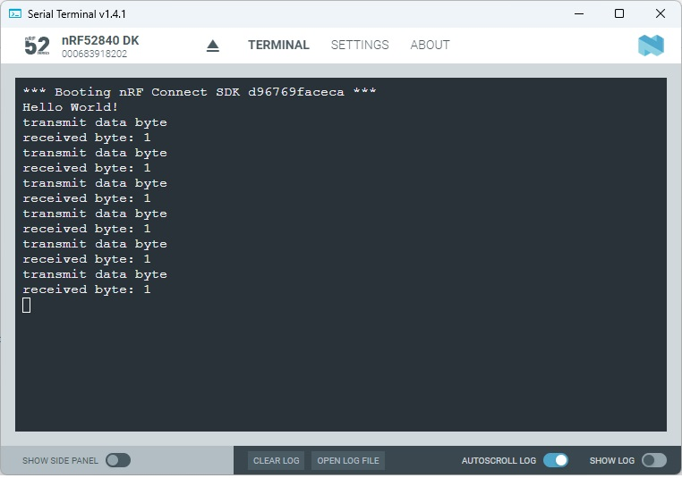

SDK version: NCS v2.6.0  -  Link to Hands-on solution: https://github.com/ChrisKurz/nRF_Connect_SDK/tree/main/Workspace/NCSv2.6.0/ZHW_UART_1

# Zephyr Hardware Driver: UART - using Polling

## Introduction

There are different UART drivers in Zephyr. All have different API functions. The different drivers support:
- _communication using polling_: this one is the most basic method of using the UART peripheral. There is a read function (_uart_poll_in()_) that is a non-blocking function and it returns a character or -1 when no valid data is available. The write function (_uart_poll_out()_) is a blocking function and the user application waits until the character is sent. 
- _interrupt-driven communication_: the UART driver handles data via an interrupt service routine while the user application can continue other tasks. 
- _asynchronous communication_: this is the most efficient way. it allows to read and write data in the background by using EasyDMA. 

In this hands-on we take a look into the polling solution. 

## Required Hardware/Software
- Development kit [nRF52840DK](https://www.nordicsemi.com/Products/Development-hardware/nRF52840-DK), [nRF52833DK](https://www.nordicsemi.com/Products/Development-hardware/nRF52833-DK), or [nRF52DK](https://www.nordicsemi.com/Products/Development-hardware/nrf52-dk), (nRF54L15DK)
  > __Note__: Two development kits allow to check communication between boards. It is also possible to test the software with one development kit; in this case the board receives the data byte it has sent.
- Micro USB Cable (Note that the cable is not included in the previous mentioned development kits.)
- install the _nRF Connect SDK_ v2.6.0 and _Visual Studio Code_. The installation process is described [here](https://academy.nordicsemi.com/courses/nrf-connect-sdk-fundamentals/lessons/lesson-1-nrf-connect-sdk-introduction/topic/exercise-1-1/).

## Hands-on step-by-step description 

### Create a new Project

1) Create a new project based on [Creating a Project from Scratch_ exercise](https://github.com/ChrisKurz/nRF_Connect_SDK/blob/main/doc/NCSv2.6.0_01_ProjectFromScratch.md). 

### Add needed Software Module _UART_

2) We need the Zephyr UART hardware driver to our project. Note that this driver is usually by default enabled. In the board definition you find for example in the __nrf52840dk_nrf52840_defconfig__ file the following lines:

       # enable uart driver
       CONFIG_SERIAL=y

    > __NOTE:__ The UART driver (CONFIG_SERIAL=y) is by default selected when working with an nRF52 development kit. For completness it was added here.

3) In order to use the UART hardware driver API we also need to add the corresponding header file to our _main.c_ file:

	_src/main.c_

       #include <zephyr/drivers/uart.h>

### Adding DeviceTree overlay file for UART

4) Create an overlay file. (e.g. __nrf52840DK_nrf52840.overlay__)

5) UART0 is already usind on the development kit for the logging. It's usage is already defined in the board definition files. We will use UART1 in our example here for our own UART communication. Add following lines in the device tree overlay file of your project. 

	_nrf52840DK_nrf52840.overlay_

        &pinctrl {
                 uart1_default: uart1_default {
                      group1 {
                             psels = <NRF_PSEL(UART_RX, 1, 1)>;
                             bias-pull-up;
                      };
                      group2 {
                             psels = <NRF_PSEL(UART_TX, 1, 2)>;
                      };
                 };

                 uart1_sleep: uart1_sleep {
                      group1 {
                             psels = <NRF_PSEL(UART_RX, 1, 1)>,
                                     <NRF_PSEL(UART_TX, 1, 2)>;
                             low-power-enable;
                      };
                 };
       };

       &uart1 {
               compatible = "nordic,nrf-uart";
               status = "okay";
               current-speed = <115200>;
               pinctrl-0 = <&uart1_default>;
               pinctrl-1 = <&uart1_sleep>;
               pinctrl-names = "default", "sleep";
       };

### Including DeviceTree Configuration in C source code

6) First, include the devicetree header file into your project.

	_src/main.c_

       #include <zephyr/devicetree.h>

7) We need a variable of type __device__ for the UART instance. 

	_src/main.c_

        static const struct device *const my_uart = DEVICE_DT_GET(DT_NODELABEL(uart1)); 

8) Before we use the UART we should check if the UART peripheral driver is ready. 

	_src/main.c_ => main() function

         if (!device_is_ready(my_uart)) {
             printk("UART device not ready\n");
             return 0;
         }

### Let's add polling for received data

9)  The polling function allows to receive a single byte. So we will store the received by in the variable _data_.

	_src/main.c_ => main() function
 
            unsigned char data;

10) Let's add the while(1) loop in main function and call the _uart_poll_in()_ API function. 

	_src/main.c_ => main() function
 
            while(1){
                while(uart_poll_in(my_uart, &data) <0){
                    /* Allow other thread/workqueue to work. */
                    k_yield();            
                }
            }

11) Let's output the received byte in the PC's serial terminal program. 

	_src/main.c_ => main() function

            printk("received byte: %c \n", data); 

### Now add transmit 

12) We use a timer here to send one character each second. So let's setup the Timer. First define the k_timer variable.

	_src/main.c_

        struct k_timer MyTimer;
 
13) And then initialize the timer.

	_src/main.c_ => main() function

            k_timer_init(&MyTimer, TimerExpire, TimerStopped);
            k_timer_start(&MyTimer, K_MSEC(0), K_MSEC(1000)); // period 1 second

> __NOTE__: You can also check the [Timer](https://github.com/ChrisKurz/nRF_Connect_SDK/blob/main/doc/NCSv2.5.0_ZKS_Timing_02_Timers.md) hands-on.

14) Let's add in TimerExpire function the transmit command.

	_src/main.c_

        static void TimerExpire(struct k_timer *timer) {
            printk("transmit data byte \n");
            uart_poll_out(my_uart, (unsigned char) '1');
        }

        static void TimerStopped(struct k_timer *timer) {
            printk("Timer was stopped!\n");       
        }

## Testing

15) In case you have only one Developement kit, you could also short the RX and TX pin on your Dev Kit. So you will receive the data byte "1", which is sent each second. In this case the Serial Terminal looks like this:

    
   
17) There are different ways to test the software. In case you have two development kits you can connect both boards as follow_
    -  __Dev Kit 1__ <----> __Dev Kit 2__
    -  GND <----> GND      
    -  TX pin <----> RX pin    
    -  RX pin <----> TX pin    

   Open two Serial Terminal windows and connect the each one with one of your dev kits boards. you should see the same output as in previous step. However, this time the received data comes from the other board.

