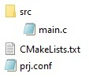
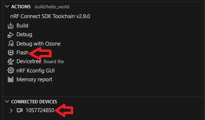

SDK version: NCS v2.9.0  -  Link to Hands-on solution: https://github.com/ChrisKurz/nRF_Connect_SDK/tree/main/Workspace/NCSv2.9.0/hello_world

# Getting started: Creating a Project from Scratch

## Introduction

Creating a project from scratch is quite simple with Zephyr. Here is a description how to create the simplest version of a project. We use Visual Studio Code in this example.

## Required Hardware/Software
- Development kit [[nRF54L15DK](https://www.nordicsemi.com/Products/Development-hardware/nRF54L15-DK), nRF52840DK](https://www.nordicsemi.com/Products/Development-hardware/nRF52840-DK), [nRF52833DK](https://www.nordicsemi.com/Products/Development-hardware/nRF52833-DK), or [nRF52DK](https://www.nordicsemi.com/Products/Development-hardware/nrf52-dk) 
- Micro USB Cable (Note that the cable is not included in the previous mentioned development kits.)
- install the _nRF Connect SDK_ v2.9.0 and _Visual Studio Code_. The installation process is described [here](https://academy.nordicsemi.com/courses/nrf-connect-sdk-fundamentals/lessons/lesson-1-nrf-connect-sdk-introduction/topic/exercise-1-1/).

## Hands-on step-by-step description 

### Create needed Folders and Files

1) First we create a __Workspace__ directory. This is where we will add all our projects. It is important that no spaces are used in the directory name and that the project directory paths are not too long, i.e. the Workspace should be close to the root directory. For example:   __C:/Nordic/Workspace__

2) Our first project is "Hello World". So we create a project folder __hello_world__ in our workspace directory:    __C:/Nordic/Workspace/hello_world__

    __NOTE: Folder name should start with a letter and there should be no spaces in the folder name!__

3) We need the following files in our project folder:

   

   __NOTE: You can create these files in Windows File Explorer as follow: open a folder, then click inside this folder with the right mouse button. In context menu select "New" and "Text Document". It is important that the file extension is also changed for some files! You have to enable the file name extensions in the Windows File Explorer menu "View" and ensure a tick is set at "File name extensions".__

4) Create the following three files in our project directory:

    _c:/Nordic/Workspace/hello_world/CMakeLists.txt_
    
       # SPDX-License-Identifier: Apache-2.0

       cmake_minimum_required(VERSION 3.21.0)

       # Find external Zephyr project, and load its settings
       find_package(Zephyr REQUIRED HINTS $ENV{ZEPHYR_BASE})

       # Set project name
       project (MyApp)

       # Add sources
       target_sources(app PRIVATE src/main.c)             

    _c:/Nordic/Workspace/hello_world/prj.conf_
    
       # This line is just a comment. In this simple project we use the default configuration. 
       
    and create main.c in the subfolder _src_:
   
    _c:/Nordic/Workspace/hello_world/src/main.c_
    
       #include <zephyr/kernel.h>

       int main(void)
       {
            printk("Hello World!\n");

            return 0;
       }

   NOTE: In the __main.c__ file we use the _printk()_ instruction. To be able to use this function, we must insert the line __#include <zephyr/sys/printk.h>__. Please note that the header file __kernel.h__ also includes other header files, such as the __printk.h__ file. For this reason, we only include the __kernel.h__ file in the main.c file above.

## Testing

5) Start Visual Studio Code.

6) Click on "+ Open an existing application" and select the __hello_world__ folder. (our project folder is the folder in which the files __CMakeLists.txt__ and __prj.conf__ are located.)

   

7) Before we can compile our project, we have to __add build configuration__. This is done by clicking on the line "+ Add build configuration".

   

8) We add the following settings in the __add build configuration__ window:
 
   

   The first line on this windows shows you the seleced SDK version and toolchain version. You can change it by clicking on this line. Note that the drop down list shows only the installed SDK and toolchain versions. IF the version that you would like to select is not listed, then click in the Welcome menu on "Manage toolchains" or "Manage SDKs" and installed the required versions. Ensure the toolchain version __v2.9.0__ and SDK version __v2.9.0__ is selected for this hands-on.

   In the __Board__ drop down list enter the board name of your development kit. When you enter the name you should see that the list will be filtered. 

   __NOTE: Beside the developement kit name, the board name mentions also a chip name. This is done, because smaller devices may be emulated by using a development kit with a bigger devices. For example, the board name "nRF52840DK_nRF52811" shows that the nRF52840DK kit is used to emulate an nRF52811.__

   __ NOTE: There is a possibility to filter the board drop down list. Below the drop down list box you can select for showing only certain boards, e.g. "Nordic SOC", "Nordic kits", "Custom" in case you have also added custom boards, or "All" boards can be listed. 

   The "Build diretory name" is the folder name that will be used for storing all build files. Often the default name is used. However, sometimes if you want to handle different builds it might be helpful to define here a meaningful name. In our hands-on we can use the default setting.

   We use the default settings for all other fields. 

9) Click __Build Configuration__ button.

10) After the project build is completed, check all the available files in the hello_world folder.

   

11) Ensure that the connected kit is found and click __Flash__ in the ACTIONS menu.  

   

12) Open a terminal program, for example the _Serial Terminal_ that is available in _nRF Connect for Desktop_
 
    Settings: 115200 baud, 8 data bits, 1 stop bit, no parity, no flow control
    
    __NOTE: These are the default settings that are usually used on Nordic development kits. It is also the default setting of _Serial Terminal_ program.__

13) Reset the kit. The Zephyr boot message and "Hello World" string is shown in the terminal. 

   
